## Initialisation

Create and visualise dataset from DB. 

First some technical initialisations:


```python
!conda update -y dask
```

    Solving environment: done
    
    
    ==> WARNING: A newer version of conda exists. <==
      current version: 4.5.12
      latest version: 4.8.1
    
    Please update conda by running
    
        $ conda update -n base -c defaults conda
    
    
    
    ## Package Plan ##
    
      environment location: /home/ec2-user/anaconda3/envs/python3
    
      added / updated specs: 
        - dask
    
    
    The following packages will be downloaded:
    
        package                    |            build
        ---------------------------|-----------------
        dask-2.10.0                |             py_0          12 KB
        dask-core-2.10.0           |             py_0         595 KB
        distributed-2.10.0         |             py_0         424 KB
        ------------------------------------------------------------
                                               Total:         1.0 MB
    
    The following packages will be UPDATED:
    
        dask:        2.9.2-py_0 --> 2.10.0-py_0
        dask-core:   2.9.2-py_0 --> 2.10.0-py_0
        distributed: 2.9.3-py_0 --> 2.10.0-py_0
    
    
    Downloading and Extracting Packages
    dask-2.10.0          | 12 KB     | ##################################### | 100% 
    dask-core-2.10.0     | 595 KB    | ##################################### | 100% 
    distributed-2.10.0   | 424 KB    | ##################################### | 100% 
    Preparing transaction: done
    Verifying transaction: done
    Executing transaction: done


```python
import pandas as pd
import psycopg2
from dask.distributed import Client
import dask.dataframe as dd
import dask
import matplotlib.pyplot as plt
import matplotlib.dates as mdates
import seaborn as sns
import datetime
import numpy as np
from scipy.stats import pearsonr
import boto3, yaml
from sagemaker import get_execution_role
from dask import delayed
from datetime import timedelta
from sqlalchemy import create_engine
from ipywidgets import IntProgress
from IPython.display import display
import time
import matplotlib.ticker as mticker

sns.set()
sns.set_style("whitegrid")
%matplotlib inline
```


```python
client = Client('Dask-Scheduler.local-dask:8786')
```

    /home/ec2-user/anaconda3/envs/python3/lib/python3.6/site-packages/distributed/client.py:1071: VersionMismatchWarning: Mismatched versions found
    
    blosc
    +--------------------------+---------+
    |                          | version |
    +--------------------------+---------+
    | client                   | None    |
    | scheduler                | 1.7.0   |
    | tcp://172.31.0.48:9000   | 1.7.0   |
    | tcp://172.31.1.97:9000   | 1.7.0   |
    | tcp://172.31.10.246:9000 | 1.7.0   |
    | tcp://172.31.13.126:9000 | 1.7.0   |
    | tcp://172.31.14.215:9000 | 1.7.0   |
    | tcp://172.31.15.161:9000 | 1.7.0   |
    | tcp://172.31.15.202:9000 | 1.7.0   |
    | tcp://172.31.24.58:9000  | 1.7.0   |
    | tcp://172.31.25.15:9000  | 1.7.0   |
    | tcp://172.31.26.201:9000 | 1.7.0   |
    | tcp://172.31.28.200:9000 | 1.7.0   |
    | tcp://172.31.28.76:9000  | 1.7.0   |
    | tcp://172.31.28.78:9000  | 1.7.0   |
    | tcp://172.31.35.192:9000 | 1.7.0   |
    | tcp://172.31.37.88:9000  | 1.7.0   |
    | tcp://172.31.42.122:9000 | 1.7.0   |
    | tcp://172.31.42.88:9000  | 1.7.0   |
    | tcp://172.31.43.211:9000 | 1.7.0   |
    | tcp://172.31.44.219:9000 | 1.7.0   |
    | tcp://172.31.44.247:9000 | 1.7.0   |
    | tcp://172.31.45.6:9000   | 1.7.0   |
    | tcp://172.31.46.187:9000 | 1.7.0   |
    | tcp://172.31.5.30:9000   | 1.7.0   |
    | tcp://172.31.6.95:9000   | 1.7.0   |
    | tcp://172.31.7.231:9000  | 1.7.0   |
    +--------------------------+---------+
    
    cloudpickle
    +--------------------------+---------+
    |                          | version |
    +--------------------------+---------+
    | client                   | 0.5.3   |
    | scheduler                | 1.2.2   |
    | tcp://172.31.0.48:9000   | 1.2.2   |
    | tcp://172.31.1.97:9000   | 1.2.2   |
    | tcp://172.31.10.246:9000 | 1.2.2   |
    | tcp://172.31.13.126:9000 | 1.2.2   |
    | tcp://172.31.14.215:9000 | 1.2.2   |
    | tcp://172.31.15.161:9000 | 1.2.2   |
    | tcp://172.31.15.202:9000 | 1.2.2   |
    | tcp://172.31.24.58:9000  | 1.2.2   |
    | tcp://172.31.25.15:9000  | 1.2.2   |
    | tcp://172.31.26.201:9000 | 1.2.2   |
    | tcp://172.31.28.200:9000 | 1.2.2   |
    | tcp://172.31.28.76:9000  | 1.2.2   |
    | tcp://172.31.28.78:9000  | 1.2.2   |
    | tcp://172.31.35.192:9000 | 1.2.2   |
    | tcp://172.31.37.88:9000  | 1.2.2   |
    | tcp://172.31.42.122:9000 | 1.2.2   |
    | tcp://172.31.42.88:9000  | 1.2.2   |
    | tcp://172.31.43.211:9000 | 1.2.2   |
    | tcp://172.31.44.219:9000 | 1.2.2   |
    | tcp://172.31.44.247:9000 | 1.2.2   |
    | tcp://172.31.45.6:9000   | 1.2.2   |
    | tcp://172.31.46.187:9000 | 1.2.2   |
    | tcp://172.31.5.30:9000   | 1.2.2   |
    | tcp://172.31.6.95:9000   | 1.2.2   |
    | tcp://172.31.7.231:9000  | 1.2.2   |
    +--------------------------+---------+
    
    msgpack
    +--------------------------+---------+
    |                          | version |
    +--------------------------+---------+
    | client                   | 0.6.0   |
    | scheduler                | 0.6.1   |
    | tcp://172.31.0.48:9000   | 0.6.1   |
    | tcp://172.31.1.97:9000   | 0.6.1   |
    | tcp://172.31.10.246:9000 | 0.6.1   |
    | tcp://172.31.13.126:9000 | 0.6.1   |
    | tcp://172.31.14.215:9000 | 0.6.1   |
    | tcp://172.31.15.161:9000 | 0.6.1   |
    | tcp://172.31.15.202:9000 | 0.6.1   |
    | tcp://172.31.24.58:9000  | 0.6.1   |
    | tcp://172.31.25.15:9000  | 0.6.1   |
    | tcp://172.31.26.201:9000 | 0.6.1   |
    | tcp://172.31.28.200:9000 | 0.6.1   |
    | tcp://172.31.28.76:9000  | 0.6.1   |
    | tcp://172.31.28.78:9000  | 0.6.1   |
    | tcp://172.31.35.192:9000 | 0.6.1   |
    | tcp://172.31.37.88:9000  | 0.6.1   |
    | tcp://172.31.42.122:9000 | 0.6.1   |
    | tcp://172.31.42.88:9000  | 0.6.1   |
    | tcp://172.31.43.211:9000 | 0.6.1   |
    | tcp://172.31.44.219:9000 | 0.6.1   |
    | tcp://172.31.44.247:9000 | 0.6.1   |
    | tcp://172.31.45.6:9000   | 0.6.1   |
    | tcp://172.31.46.187:9000 | 0.6.1   |
    | tcp://172.31.5.30:9000   | 0.6.1   |
    | tcp://172.31.6.95:9000   | 0.6.1   |
    | tcp://172.31.7.231:9000  | 0.6.1   |
    +--------------------------+---------+
    
    numpy
    +--------------------------+---------+
    |                          | version |
    +--------------------------+---------+
    | client                   | 1.14.3  |
    | scheduler                | 1.18.1  |
    | tcp://172.31.0.48:9000   | 1.18.1  |
    | tcp://172.31.1.97:9000   | 1.18.1  |
    | tcp://172.31.10.246:9000 | 1.18.1  |
    | tcp://172.31.13.126:9000 | 1.18.1  |
    | tcp://172.31.14.215:9000 | 1.18.1  |
    | tcp://172.31.15.161:9000 | 1.18.1  |
    | tcp://172.31.15.202:9000 | 1.18.1  |
    | tcp://172.31.24.58:9000  | 1.18.1  |
    | tcp://172.31.25.15:9000  | 1.18.1  |
    | tcp://172.31.26.201:9000 | 1.18.1  |
    | tcp://172.31.28.200:9000 | 1.18.1  |
    | tcp://172.31.28.76:9000  | 1.18.1  |
    | tcp://172.31.28.78:9000  | 1.18.1  |
    | tcp://172.31.35.192:9000 | 1.18.1  |
    | tcp://172.31.37.88:9000  | 1.18.1  |
    | tcp://172.31.42.122:9000 | 1.18.1  |
    | tcp://172.31.42.88:9000  | 1.18.1  |
    | tcp://172.31.43.211:9000 | 1.18.1  |
    | tcp://172.31.44.219:9000 | 1.18.1  |
    | tcp://172.31.44.247:9000 | 1.18.1  |
    | tcp://172.31.45.6:9000   | 1.18.1  |
    | tcp://172.31.46.187:9000 | 1.18.1  |
    | tcp://172.31.5.30:9000   | 1.18.1  |
    | tcp://172.31.6.95:9000   | 1.18.1  |
    | tcp://172.31.7.231:9000  | 1.18.1  |
    +--------------------------+---------+
    
    toolz
    +--------------------------+---------+
    |                          | version |
    +--------------------------+---------+
    | client                   | 0.9.0   |
    | scheduler                | 0.10.0  |
    | tcp://172.31.0.48:9000   | 0.10.0  |
    | tcp://172.31.1.97:9000   | 0.10.0  |
    | tcp://172.31.10.246:9000 | 0.10.0  |
    | tcp://172.31.13.126:9000 | 0.10.0  |
    | tcp://172.31.14.215:9000 | 0.10.0  |
    | tcp://172.31.15.161:9000 | 0.10.0  |
    | tcp://172.31.15.202:9000 | 0.10.0  |
    | tcp://172.31.24.58:9000  | 0.10.0  |
    | tcp://172.31.25.15:9000  | 0.10.0  |
    | tcp://172.31.26.201:9000 | 0.10.0  |
    | tcp://172.31.28.200:9000 | 0.10.0  |
    | tcp://172.31.28.76:9000  | 0.10.0  |
    | tcp://172.31.28.78:9000  | 0.10.0  |
    | tcp://172.31.35.192:9000 | 0.10.0  |
    | tcp://172.31.37.88:9000  | 0.10.0  |
    | tcp://172.31.42.122:9000 | 0.10.0  |
    | tcp://172.31.42.88:9000  | 0.10.0  |
    | tcp://172.31.43.211:9000 | 0.10.0  |
    | tcp://172.31.44.219:9000 | 0.10.0  |
    | tcp://172.31.44.247:9000 | 0.10.0  |
    | tcp://172.31.45.6:9000   | 0.10.0  |
    | tcp://172.31.46.187:9000 | 0.10.0  |
    | tcp://172.31.5.30:9000   | 0.10.0  |
    | tcp://172.31.6.95:9000   | 0.10.0  |
    | tcp://172.31.7.231:9000  | 0.10.0  |
    +--------------------------+---------+
    
    tornado
    +--------------------------+---------+
    |                          | version |
    +--------------------------+---------+
    | client                   | 5.0.2   |
    | scheduler                | 6.0.3   |
    | tcp://172.31.0.48:9000   | 6.0.3   |
    | tcp://172.31.1.97:9000   | 6.0.3   |
    | tcp://172.31.10.246:9000 | 6.0.3   |
    | tcp://172.31.13.126:9000 | 6.0.3   |
    | tcp://172.31.14.215:9000 | 6.0.3   |
    | tcp://172.31.15.161:9000 | 6.0.3   |
    | tcp://172.31.15.202:9000 | 6.0.3   |
    | tcp://172.31.24.58:9000  | 6.0.3   |
    | tcp://172.31.25.15:9000  | 6.0.3   |
    | tcp://172.31.26.201:9000 | 6.0.3   |
    | tcp://172.31.28.200:9000 | 6.0.3   |
    | tcp://172.31.28.76:9000  | 6.0.3   |
    | tcp://172.31.28.78:9000  | 6.0.3   |
    | tcp://172.31.35.192:9000 | 6.0.3   |
    | tcp://172.31.37.88:9000  | 6.0.3   |
    | tcp://172.31.42.122:9000 | 6.0.3   |
    | tcp://172.31.42.88:9000  | 6.0.3   |
    | tcp://172.31.43.211:9000 | 6.0.3   |
    | tcp://172.31.44.219:9000 | 6.0.3   |
    | tcp://172.31.44.247:9000 | 6.0.3   |
    | tcp://172.31.45.6:9000   | 6.0.3   |
    | tcp://172.31.46.187:9000 | 6.0.3   |
    | tcp://172.31.5.30:9000   | 6.0.3   |
    | tcp://172.31.6.95:9000   | 6.0.3   |
    | tcp://172.31.7.231:9000  | 6.0.3   |
    +--------------------------+---------+
      warnings.warn(version_module.VersionMismatchWarning(msg[0]["warning"]))


```python
client.get_versions(check=False)
client
```


<table style="border: 2px solid white;">
<tr>
<td style="vertical-align: top; border: 0px solid white">
<h3 style="text-align: left;">Client</h3>
<ul style="text-align: left; list-style: none; margin: 0; padding: 0;">
  <li><b>Scheduler: </b>tcp://Dask-Scheduler.local-dask:8786</li>
  <li><b>Dashboard: </b><a href='http://Dask-Scheduler.local-dask:8787/status' target='_blank'>http://Dask-Scheduler.local-dask:8787/status</a>
</ul>
</td>
<td style="vertical-align: top; border: 0px solid white">
<h3 style="text-align: left;">Cluster</h3>
<ul style="text-align: left; list-style:none; margin: 0; padding: 0;">
  <li><b>Workers: </b>25</li>
  <li><b>Cores: </b>50</li>
  <li><b>Memory: </b>45.00 GB</li>
</ul>
</td>
</tr>
</table>


For loading data:


```python
db_host = '***REMOVED***'
db_port = 5432
db_name = "postgres"
db_user = "***REMOVED***"
db_pass = "***REMOVED***"
conf_bucket  ='fmi-sasse-cloudformation'
conf_file    = 'smartmet.yaml'
loiste_bbox  = '25,62.7,31.4,66.4'
sssoy_bbox   = '24.5,60,30.6,63.5'
```

Load params:


```python
s3 = boto3.resource('s3')

content_object = s3.Object(conf_bucket, conf_file)
file_content = content_object.get()['Body'].read().decode('utf-8')
config_dict = yaml.load(file_content)

params = config_dict['params']
met_params = set()
shortnames = True
for param, info in params.items():
    for f in info['aggregation']:
        if shortnames:
            met_params.add(f[1:]+' '+info['name'])
        else:
            met_params.add(f+'{'+param+'}')
met_params = list(met_params)
```

Update polygon and meteorlogical params. Lists are used in process_polygons function and while saving the data to db.


```python
polygon_params = ['speed_self', 'angle_self', 'area_m2', 'area_diff']
meta_params = ['id', 'storm_id', 'point_in_time', 'weather_parameter', 'low_limit', 'high_limit']
outage_params = ['outages', 'customers']
transformers_params = ['transformers', 'all_customers']
storm_params = polygon_params + met_params
all_params = meta_params + storm_params + outage_params
```

Functions to save dataset (used later)


```python
def save_dataset(df, table_name='classification_dataset'):
    """
    Save classification dataset into the db

    df : DataFrame
         DataFrame data
    """
    if df is None or len(df) < 1:
        return
    print('Storing classification set to db sasse.{}...'.format(table_name))

    # db_name, db_user, db_host, db_pass
    engine = create_engine('postgresql://{user}:{passwd}@{host}:5432/{db}'.format(user=db_user,
                                                                                 passwd=db_pass,
                                                                                 host=db_host,
                                                                                 db=db_name))

    index_name = 'id'
    df.to_sql(table_name, engine, schema='sasse', if_exists='append', index=False)

def load_dataset(table_name='classification_dataset'):
    """
    Load classification dataset from db
    
    table_name : str
                 table name to be used
    """
    all_params_w_labels = all_params + ['class', 'class_customers']
    conn = psycopg2.connect("dbname='%s' user='%s' host='%s' password='%s'" % (db_name, db_user, db_host, db_pass))
    sql = """SELECT "{}" FROM sasse.{}""".format('","'.join(all_params_w_labels), table_name)

    cursor = conn.cursor()
    cursor.execute(sql)
    results = cursor.fetchall()
    df = pd.DataFrame(results, columns=all_params_w_labels)
    df.set_index('point_in_time', inplace=True)
    return df    
```

## Creating and loading dataset

### Loiste + JSE

#### Create dataset

Get dataset from db. This is a long process. If the dataset is already saved, this may be skipped.


```python
def get_dataset(start, end, meta_params, storm_params, outage_params, transformer_params, all_params, paraller=True):
    """ Gather dataset from db """
    #print('Reading data for {}-{}...'.format(start, end))
    conn = psycopg2.connect("dbname='%s' user='%s' host='%s' password='%s'" % (db_name, db_user, db_host, db_pass))
    sql = """
        SELECT 
        """
    first = True
    for p in meta_params:
        if not first:
            sql += ','
        first = False
        sql += "a.{}".format(p)

    for p in storm_params:
            sql += ',"{}"'.format(p)
    for p in outage_params:
        sql += ',c.{}'.format(p)
#    for p in transformer_params:
#        sql += ',d.{}'.format(p)

    sql += """
        FROM
         sasse.stormcell a
         INNER JOIN sasse.stormcell_features b ON a.id = b.polygon_id
         LEFT JOIN (
                  SELECT
                           b.id,
                           COUNT(1) AS outages,
                           SUM(customers) AS customers
                  FROM
                           sasse.outages a,
                           sasse.stormcell b
                  WHERE
                           date_trunc('hour', a.start AT TIME ZONE 'Europe/Helsinki' AT TIME ZONE 'UTC') + interval '1 hour' = point_in_time
                           AND ST_Intersects(st_setsrid (the_geom, 4326), st_setsrid (geom, 4326))
                           AND a.type NOT IN ('maintenance', 'planned')
                           AND point_in_time >= '{start}'
                           AND point_in_time <= '{end}'
                  GROUP BY
                           b.id) c ON c.id = a.id
         LEFT JOIN (
                  SELECT
                           b.id,
                           COUNT(1) AS transformers,
                           SUM(customers) as all_customers
                  FROM
                           sasse.transformer a,
                           sasse.stormcell b
                  WHERE
                           ST_Intersects(st_setsrid (a.geom, 4326), st_setsrid (b.geom, 4326))
                           AND point_in_time >= '{start}'
                           AND point_in_time <= '{end}'
                  GROUP BY
                           b.id) d ON d.id = a.id
        WHERE (st_intersects(ST_MakeEnvelope(25.5, 61.0, 29.6, 62.5, 4326), st_setsrid (geom, 4326))
            OR st_intersects(ST_MakeEnvelope(26.1, 63.7, 30.3, 65.5, 4326), st_setsrid (geom, 4326)))
        AND point_in_time >= '{start}'
        AND point_in_time <= '{end}'
    """.format(start=start, end=end)

    cursor = conn.cursor()
    cursor.execute(sql)
    results = cursor.fetchall()

    print('.', end='')
    
    df = pd.DataFrame(results, columns=all_params)
    
    return df    
```


```python
%%time
from dask.distributed import progress
starttime = datetime.datetime.strptime('2010-01-01', "%Y-%m-%d")
endtime = datetime.datetime.strptime('2019-01-01', "%Y-%m-%d")
paraller = True

print('Reading data for {}-{}'.format(starttime, endtime))
# Progress bar
max_count = 108 # would be better to calculate
f = IntProgress(min=0, max=max_count) # instantiate the bar
display(f) # display the bar

dfs, df = [], []
start = starttime
while start <= endtime:
    end = start + timedelta(days=1)
    if paraller: dfs.append(delayed(get_dataset)(start.strftime('%Y-%m-%d'), end.strftime('%Y-%m-%d'), meta_params, storm_params, outage_params, transformers_params, all_params))
    else: df.append(get_dataset(start.strftime('%Y-%m-%d'), end.strftime('%Y-%m-%d'), meta_params, storm_params, outage_params, transformers_params, all_params, paraller))
    start = end

if paraller:
    df = dask.compute(*dfs)
    progress(df)

dataset = pd.concat(df)
    
dataset.sort_values(by=['point_in_time'], inplace=True)
print('\nDone. Found {} records'.format(dataset.shape[0]))
```

    Reading data for 2010-01-01 00:00:00-2019-01-01 00:00:00


    IntProgress(value=0, max=108)


    
    Done. Found 28188 records
    CPU times: user 21.4 s, sys: 996 ms, total: 22.4 s
    Wall time: 2h 15min 46s


If outages and customers are none, they are 0. If all_customers or all_transformers is 0, the cell do not overlap the power grid. Those lines may be dropped.


```python
dataset.loc[:,['outages','customers']] = dataset.loc[:,['outages','customers']].fillna(0)
dataset.loc[:,['outages','customers']] = dataset.loc[:,['outages','customers']].astype(int)
dataset.dropna(axis=0, subset=['all_customers', 'transformers'], inplace=True)

# Drop rows with missing meteorological params
for p in met_params:
    dataset = dataset[dataset[p] != -999]

dataset.sort_values(by=['outages'], inplace=True)
```

#### Cast classes

Following plots help us to divide data to classes.


```python
fig, ax = plt.subplots(figsize=(20,5))
dataset.loc[(dataset['outages'] >= 1), :].groupby(by=['outages']).count()['id'].plot(kind='bar', title='Number of polygons by outages')
plt.ylabel('Number of polygons')
plt.grid(False)

fig, ax = plt.subplots(figsize=(20,5))
dataset.loc[(dataset['customers'] >= 1), :].groupby(by=['customers']).count()['id'].plot(kind='bar', title='Number of polygons by customers')
xtick_count = 15
every_nth = len(ax.xaxis.get_ticklabels()) // xtick_count

for n, label in enumerate(ax.xaxis.get_ticklabels()):
    if n % every_nth != 0:
        label.set_visible(False)
plt.ylabel('Number of polygons')
plt.grid(False)

fig, ax = plt.subplots(figsize=(5,5))
dataset.plot(kind='scatter', x='outages', y='customers', ax=ax, c='green')
```


    <matplotlib.axes._subplots.AxesSubplot at 0x7f0587d1e080>


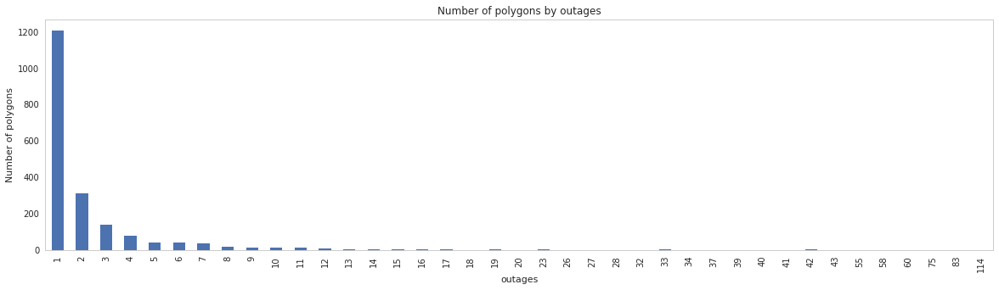


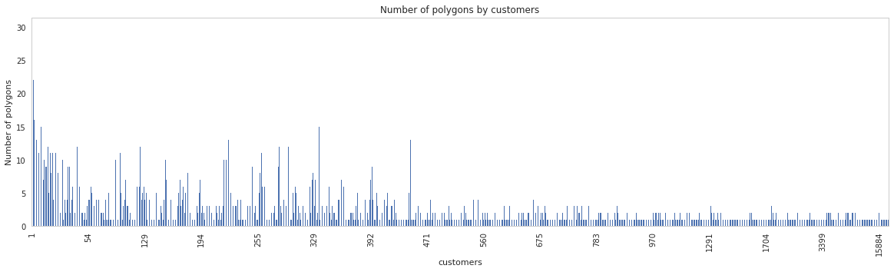


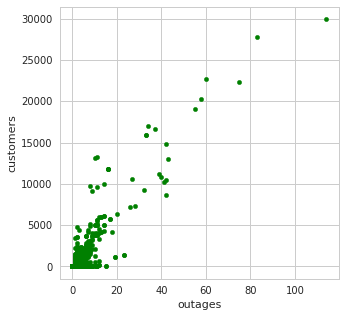


From above plots we can see that most of the polygons cause only 1 outage. It is notable that because reason of outages are not saved reliably, this bin may include a lot of noise. Outages are always reported from transformers. Second and third plot help us to give sense how many customers (namely houses) each outage means. 

First, if number of outages is 0, the class is 0. Rest of the dataset could be divided to classes following: 

Class 1:  1 - 2  outages  --> max ~50 customers without electricity<br>
Class 2:  3 - 10 outages  --> max ~250 customers without electricity <br>
Class 3: 11 -    outages  --> lots of customers without electricity<br>

We can also classify the data based on number of customers respectively:. 

Class 1:   1 -  50 cusomters  --> max ~2 outages<br>
Class 2:  51 - 250 customers  --> max ~10 outages <br>
Class 3: 251 -     customers  --> lots of outages<br>


```python
# outages
limits = [(0,0), (1,2), (3,10), (11, 9999999)]
i = 0
for low, high in limits:
    dataset.loc[(dataset.loc[:, 'outages'] >= low) & (dataset.loc[:, 'outages'] <= high), 'class'] = i
    i += 1
    
# outages
limits = [(0,0), (1,50), (51,250), (251, 9999999)]
i = 0
for low, high in limits:
    dataset.loc[(dataset.loc[:, 'customers'] >= low) & (dataset.loc[:, 'customers'] <= high), 'class_customers'] = i
    i += 1

dataset.loc[:, ['class', 'class_customers']] = dataset.loc[:, ['class', 'class_customers']].astype(int)
dataset
```


<div>
<style scoped>
    .dataframe tbody tr th:only-of-type {
        vertical-align: middle;
    }

    .dataframe tbody tr th {
        vertical-align: top;
    }

    .dataframe thead th {
        text-align: right;
    }
</style>
<table border="1" class="dataframe">
  <thead>
    <tr style="text-align: right;">
      <th></th>
      <th>id</th>
      <th>storm_id</th>
      <th>point_in_time</th>
      <th>weather_parameter</th>
      <th>low_limit</th>
      <th>high_limit</th>
      <th>speed_self</th>
      <th>angle_self</th>
      <th>area_m2</th>
      <th>area_diff</th>
      <th>...</th>
      <th>SUM Snowfall</th>
      <th>AVG Temperature</th>
      <th>MAX Wind gust</th>
      <th>MIN Pressure</th>
      <th>outages</th>
      <th>customers</th>
      <th>transformers</th>
      <th>all_customers</th>
      <th>class</th>
      <th>class_customers</th>
    </tr>
  </thead>
  <tbody>
    <tr>
      <th>0</th>
      <td>32276</td>
      <td>5607-WindGust-15-999</td>
      <td>2010-01-03 18:00:00+00:00</td>
      <td>Pressure</td>
      <td>0</td>
      <td>1000</td>
      <td>45.885378</td>
      <td>316.657149</td>
      <td>241096441088</td>
      <td>15939045602</td>
      <td>...</td>
      <td>0</td>
      <td>265</td>
      <td>26</td>
      <td>87134</td>
      <td>0</td>
      <td>0</td>
      <td>16</td>
      <td>75</td>
      <td>0</td>
      <td>0</td>
    </tr>
    <tr>
      <th>14</th>
      <td>85843</td>
      <td>NULL</td>
      <td>2010-10-21 14:00:00+00:00</td>
      <td>Pressure</td>
      <td>0</td>
      <td>1000</td>
      <td>6.663990</td>
      <td>347.916194</td>
      <td>2436625298896</td>
      <td>67935319881</td>
      <td>...</td>
      <td>0</td>
      <td>276</td>
      <td>21</td>
      <td>83531</td>
      <td>0</td>
      <td>0</td>
      <td>13241</td>
      <td>160548</td>
      <td>0</td>
      <td>0</td>
    </tr>
    <tr>
      <th>37</th>
      <td>84838</td>
      <td>54789-WindGust-15-999</td>
      <td>2010-10-15 00:00:00+00:00</td>
      <td>Pressure</td>
      <td>0</td>
      <td>1000</td>
      <td>12.006200</td>
      <td>327.169733</td>
      <td>2366620281872</td>
      <td>20036629745</td>
      <td>...</td>
      <td>1</td>
      <td>274</td>
      <td>25</td>
      <td>94320</td>
      <td>0</td>
      <td>0</td>
      <td>13241</td>
      <td>160548</td>
      <td>0</td>
      <td>0</td>
    </tr>
    <tr>
      <th>0</th>
      <td>84510</td>
      <td>NULL</td>
      <td>2010-10-13 00:00:00+00:00</td>
      <td>Pressure</td>
      <td>0</td>
      <td>1000</td>
      <td>3.033214</td>
      <td>358.466487</td>
      <td>1900868857186</td>
      <td>-12640678489</td>
      <td>...</td>
      <td>0</td>
      <td>275</td>
      <td>21</td>
      <td>95202</td>
      <td>0</td>
      <td>0</td>
      <td>24</td>
      <td>115</td>
      <td>0</td>
      <td>0</td>
    </tr>
    <tr>
      <th>11</th>
      <td>54789</td>
      <td>54789-WindGust-15-999</td>
      <td>2010-10-15 00:00:00+00:00</td>
      <td>WindGust</td>
      <td>15</td>
      <td>999</td>
      <td>-999.000000</td>
      <td>16.372905</td>
      <td>489915746</td>
      <td>489915746</td>
      <td>...</td>
      <td>0</td>
      <td>273</td>
      <td>16</td>
      <td>97665</td>
      <td>0</td>
      <td>0</td>
      <td>233</td>
      <td>3406</td>
      <td>0</td>
      <td>0</td>
    </tr>
    <tr>
      <th>2</th>
      <td>84522</td>
      <td>NULL</td>
      <td>2010-10-13 02:00:00+00:00</td>
      <td>Pressure</td>
      <td>0</td>
      <td>1000</td>
      <td>1.550326</td>
      <td>333.340322</td>
      <td>1869455169402</td>
      <td>-4098074030</td>
      <td>...</td>
      <td>0</td>
      <td>275</td>
      <td>21</td>
      <td>95258</td>
      <td>0</td>
      <td>0</td>
      <td>18</td>
      <td>64</td>
      <td>0</td>
      <td>0</td>
    </tr>
    <tr>
      <th>30</th>
      <td>78829</td>
      <td>34446-WindGust-15-999</td>
      <td>2010-09-03 06:00:00+00:00</td>
      <td>Pressure</td>
      <td>0</td>
      <td>1000</td>
      <td>21.313237</td>
      <td>40.518348</td>
      <td>708423069018</td>
      <td>12149510216</td>
      <td>...</td>
      <td>0</td>
      <td>284</td>
      <td>23</td>
      <td>96428</td>
      <td>0</td>
      <td>0</td>
      <td>499</td>
      <td>4283</td>
      <td>0</td>
      <td>0</td>
    </tr>
    <tr>
      <th>3</th>
      <td>84529</td>
      <td>NULL</td>
      <td>2010-10-13 03:00:00+00:00</td>
      <td>Pressure</td>
      <td>0</td>
      <td>1000</td>
      <td>7.607676</td>
      <td>26.050411</td>
      <td>1843938133600</td>
      <td>-25517035802</td>
      <td>...</td>
      <td>0</td>
      <td>275</td>
      <td>20</td>
      <td>95293</td>
      <td>0</td>
      <td>0</td>
      <td>12</td>
      <td>34</td>
      <td>0</td>
      <td>0</td>
    </tr>
    <tr>
      <th>1</th>
      <td>70680</td>
      <td>70592-WindGust-15-999</td>
      <td>2010-07-21 08:00:00+00:00</td>
      <td>WindGust</td>
      <td>15</td>
      <td>999</td>
      <td>-999.000000</td>
      <td>-999.000000</td>
      <td>224063739</td>
      <td>224063739</td>
      <td>...</td>
      <td>0</td>
      <td>297</td>
      <td>15</td>
      <td>99950</td>
      <td>0</td>
      <td>0</td>
      <td>170</td>
      <td>2560</td>
      <td>0</td>
      <td>0</td>
    </tr>
    <tr>
      <th>0</th>
      <td>54783</td>
      <td>52924-WindGust-20-999</td>
      <td>2010-10-15 00:00:00+00:00</td>
      <td>WindGust</td>
      <td>15</td>
      <td>999</td>
      <td>7.258795</td>
      <td>318.717761</td>
      <td>346429571503</td>
      <td>1057325490</td>
      <td>...</td>
      <td>0</td>
      <td>277</td>
      <td>25</td>
      <td>96922</td>
      <td>0</td>
      <td>0</td>
      <td>6667</td>
      <td>74804</td>
      <td>0</td>
      <td>0</td>
    </tr>
    <tr>
      <th>16</th>
      <td>84387</td>
      <td>48404-WindGust-15-999</td>
      <td>2010-10-12 05:00:00+00:00</td>
      <td>Pressure</td>
      <td>0</td>
      <td>1000</td>
      <td>11.114022</td>
      <td>301.135209</td>
      <td>1660876213947</td>
      <td>5707522037</td>
      <td>...</td>
      <td>0</td>
      <td>275</td>
      <td>23</td>
      <td>95075</td>
      <td>0</td>
      <td>0</td>
      <td>12612</td>
      <td>155406</td>
      <td>0</td>
      <td>0</td>
    </tr>
    <tr>
      <th>18</th>
      <td>84402</td>
      <td>49113-WindGust-15-999</td>
      <td>2010-10-12 07:00:00+00:00</td>
      <td>Pressure</td>
      <td>0</td>
      <td>1000</td>
      <td>20.303343</td>
      <td>314.134600</td>
      <td>1694672437789</td>
      <td>31768577499</td>
      <td>...</td>
      <td>0</td>
      <td>275</td>
      <td>24</td>
      <td>95064</td>
      <td>0</td>
      <td>0</td>
      <td>7451</td>
      <td>87041</td>
      <td>0</td>
      <td>0</td>
    </tr>
    <tr>
      <th>0</th>
      <td>71997</td>
      <td>71997-WindGust-15-999</td>
      <td>2010-07-22 07:00:00+00:00</td>
      <td>WindGust</td>
      <td>15</td>
      <td>999</td>
      <td>-999.000000</td>
      <td>355.656493</td>
      <td>2057275953</td>
      <td>2057275953</td>
      <td>...</td>
      <td>0</td>
      <td>295</td>
      <td>16</td>
      <td>98505</td>
      <td>0</td>
      <td>0</td>
      <td>25</td>
      <td>71</td>
      <td>0</td>
      <td>0</td>
    </tr>
    <tr>
      <th>19</th>
      <td>84410</td>
      <td>49111-WindGust-15-999</td>
      <td>2010-10-12 08:00:00+00:00</td>
      <td>Pressure</td>
      <td>0</td>
      <td>1000</td>
      <td>115.474283</td>
      <td>311.815278</td>
      <td>1927523130472</td>
      <td>232850692683</td>
      <td>...</td>
      <td>0</td>
      <td>276</td>
      <td>24</td>
      <td>95060</td>
      <td>0</td>
      <td>0</td>
      <td>4851</td>
      <td>61495</td>
      <td>0</td>
      <td>0</td>
    </tr>
    <tr>
      <th>1</th>
      <td>72063</td>
      <td>72004-WindGust-15-999</td>
      <td>2010-07-22 08:00:00+00:00</td>
      <td>WindGust</td>
      <td>15</td>
      <td>999</td>
      <td>17.833118</td>
      <td>24.084451</td>
      <td>12398917146</td>
      <td>12398916911</td>
      <td>...</td>
      <td>0</td>
      <td>297</td>
      <td>16</td>
      <td>98318</td>
      <td>0</td>
      <td>0</td>
      <td>1533</td>
      <td>9966</td>
      <td>0</td>
      <td>0</td>
    </tr>
    <tr>
      <th>2</th>
      <td>49250</td>
      <td>48480-WindGust-15-999</td>
      <td>2010-10-12 08:00:00+00:00</td>
      <td>WindGust</td>
      <td>15</td>
      <td>999</td>
      <td>-999.000000</td>
      <td>330.044362</td>
      <td>540392904399</td>
      <td>540392904399</td>
      <td>...</td>
      <td>0</td>
      <td>278</td>
      <td>24</td>
      <td>97464</td>
      <td>0</td>
      <td>0</td>
      <td>22</td>
      <td>319</td>
      <td>0</td>
      <td>0</td>
    </tr>
    <tr>
      <th>1</th>
      <td>57090</td>
      <td>56898-WindGust-15-999</td>
      <td>2010-07-12 11:00:00+00:00</td>
      <td>WindGust</td>
      <td>15</td>
      <td>999</td>
      <td>106.403605</td>
      <td>14.428829</td>
      <td>5471767322</td>
      <td>-31026834713</td>
      <td>...</td>
      <td>0</td>
      <td>302</td>
      <td>16</td>
      <td>99799</td>
      <td>0</td>
      <td>0</td>
      <td>197</td>
      <td>1878</td>
      <td>0</td>
      <td>0</td>
    </tr>
    <tr>
      <th>20</th>
      <td>84417</td>
      <td>49335-WindGust-15-999</td>
      <td>2010-10-12 09:00:00+00:00</td>
      <td>Pressure</td>
      <td>0</td>
      <td>1000</td>
      <td>50.306137</td>
      <td>311.115731</td>
      <td>2036309696320</td>
      <td>108786565848</td>
      <td>...</td>
      <td>0</td>
      <td>277</td>
      <td>22</td>
      <td>95073</td>
      <td>0</td>
      <td>0</td>
      <td>2878</td>
      <td>39240</td>
      <td>0</td>
      <td>0</td>
    </tr>
    <tr>
      <th>3</th>
      <td>49319</td>
      <td>48480-WindGust-15-999</td>
      <td>2010-10-12 09:00:00+00:00</td>
      <td>WindGust</td>
      <td>15</td>
      <td>999</td>
      <td>80.453919</td>
      <td>324.604673</td>
      <td>580031939510</td>
      <td>39639035111</td>
      <td>...</td>
      <td>0</td>
      <td>279</td>
      <td>24</td>
      <td>97354</td>
      <td>0</td>
      <td>0</td>
      <td>59</td>
      <td>610</td>
      <td>0</td>
      <td>0</td>
    </tr>
    <tr>
      <th>1</th>
      <td>49105</td>
      <td>48480-WindGust-15-999</td>
      <td>2010-10-12 06:00:00+00:00</td>
      <td>WindGust</td>
      <td>15</td>
      <td>999</td>
      <td>49.198427</td>
      <td>288.358140</td>
      <td>303193372078</td>
      <td>28500177091</td>
      <td>...</td>
      <td>0</td>
      <td>279</td>
      <td>24</td>
      <td>98309</td>
      <td>0</td>
      <td>0</td>
      <td>81</td>
      <td>801</td>
      <td>0</td>
      <td>0</td>
    </tr>
    <tr>
      <th>1</th>
      <td>18610</td>
      <td>18592-WindGust-15-999</td>
      <td>2010-06-20 07:00:00+00:00</td>
      <td>WindGust</td>
      <td>15</td>
      <td>999</td>
      <td>54.315354</td>
      <td>33.748155</td>
      <td>9543901871</td>
      <td>6760382568</td>
      <td>...</td>
      <td>0</td>
      <td>290</td>
      <td>18</td>
      <td>98157</td>
      <td>0</td>
      <td>0</td>
      <td>21</td>
      <td>73</td>
      <td>0</td>
      <td>0</td>
    </tr>
    <tr>
      <th>0</th>
      <td>44526</td>
      <td>44488-WindGust-15-999</td>
      <td>2010-07-04 10:00:00+00:00</td>
      <td>WindGust</td>
      <td>15</td>
      <td>999</td>
      <td>-999.000000</td>
      <td>-999.000000</td>
      <td>1475621670</td>
      <td>1475621670</td>
      <td>...</td>
      <td>0</td>
      <td>298</td>
      <td>16</td>
      <td>99073</td>
      <td>0</td>
      <td>0</td>
      <td>67</td>
      <td>284</td>
      <td>0</td>
      <td>0</td>
    </tr>
    <tr>
      <th>35</th>
      <td>84825</td>
      <td>NULL</td>
      <td>2010-10-14 22:00:00+00:00</td>
      <td>Pressure</td>
      <td>0</td>
      <td>1000</td>
      <td>11.769611</td>
      <td>299.613944</td>
      <td>2319278025627</td>
      <td>41982579172</td>
      <td>...</td>
      <td>1</td>
      <td>274</td>
      <td>26</td>
      <td>94341</td>
      <td>0</td>
      <td>0</td>
      <td>13241</td>
      <td>160548</td>
      <td>0</td>
      <td>0</td>
    </tr>
    <tr>
      <th>3</th>
      <td>70805</td>
      <td>70592-WindGust-15-999</td>
      <td>2010-07-21 10:00:00+00:00</td>
      <td>WindGust</td>
      <td>15</td>
      <td>999</td>
      <td>-999.000000</td>
      <td>-999.000000</td>
      <td>24293747046</td>
      <td>24293747046</td>
      <td>...</td>
      <td>0</td>
      <td>297</td>
      <td>17</td>
      <td>99061</td>
      <td>0</td>
      <td>0</td>
      <td>426</td>
      <td>5983</td>
      <td>0</td>
      <td>0</td>
    </tr>
    <tr>
      <th>4</th>
      <td>70887</td>
      <td>70592-WindGust-15-999</td>
      <td>2010-07-21 11:00:00+00:00</td>
      <td>WindGust</td>
      <td>15</td>
      <td>999</td>
      <td>-999.000000</td>
      <td>-999.000000</td>
      <td>120264951</td>
      <td>120264951</td>
      <td>...</td>
      <td>0</td>
      <td>299</td>
      <td>15</td>
      <td>99951</td>
      <td>0</td>
      <td>0</td>
      <td>80</td>
      <td>1100</td>
      <td>0</td>
      <td>0</td>
    </tr>
    <tr>
      <th>2</th>
      <td>72129</td>
      <td>72004-WindGust-15-999</td>
      <td>2010-07-22 09:00:00+00:00</td>
      <td>WindGust</td>
      <td>15</td>
      <td>999</td>
      <td>9.457685</td>
      <td>350.875408</td>
      <td>14039783590</td>
      <td>1640866444</td>
      <td>...</td>
      <td>0</td>
      <td>297</td>
      <td>16</td>
      <td>98197</td>
      <td>0</td>
      <td>0</td>
      <td>1420</td>
      <td>8931</td>
      <td>0</td>
      <td>0</td>
    </tr>
    <tr>
      <th>1</th>
      <td>24874</td>
      <td>24751-WindGust-15-999</td>
      <td>2010-06-27 12:00:00+00:00</td>
      <td>WindGust</td>
      <td>15</td>
      <td>999</td>
      <td>67.686609</td>
      <td>12.513636</td>
      <td>530684899</td>
      <td>516914341</td>
      <td>...</td>
      <td>0</td>
      <td>286</td>
      <td>15</td>
      <td>99948</td>
      <td>0</td>
      <td>0</td>
      <td>76</td>
      <td>428</td>
      <td>0</td>
      <td>0</td>
    </tr>
    <tr>
      <th>4</th>
      <td>24927</td>
      <td>24680-WindGust-15-999</td>
      <td>2010-06-27 13:00:00+00:00</td>
      <td>WindGust</td>
      <td>15</td>
      <td>999</td>
      <td>1.790444</td>
      <td>352.339531</td>
      <td>273006306</td>
      <td>3983791</td>
      <td>...</td>
      <td>0</td>
      <td>286</td>
      <td>15</td>
      <td>98576</td>
      <td>0</td>
      <td>0</td>
      <td>47</td>
      <td>194</td>
      <td>0</td>
      <td>0</td>
    </tr>
    <tr>
      <th>5</th>
      <td>24939</td>
      <td>24751-WindGust-15-999</td>
      <td>2010-06-27 13:00:00+00:00</td>
      <td>WindGust</td>
      <td>15</td>
      <td>999</td>
      <td>1.280821</td>
      <td>165.158129</td>
      <td>95247705</td>
      <td>-435437194</td>
      <td>...</td>
      <td>0</td>
      <td>287</td>
      <td>15</td>
      <td>100170</td>
      <td>0</td>
      <td>0</td>
      <td>9</td>
      <td>21</td>
      <td>0</td>
      <td>0</td>
    </tr>
    <tr>
      <th>1</th>
      <td>25538</td>
      <td>25434-WindGust-15-999</td>
      <td>2010-06-28 06:00:00+00:00</td>
      <td>WindGust</td>
      <td>15</td>
      <td>999</td>
      <td>28.145884</td>
      <td>316.499124</td>
      <td>123368521587</td>
      <td>31981922771</td>
      <td>...</td>
      <td>0</td>
      <td>285</td>
      <td>19</td>
      <td>97046</td>
      <td>0</td>
      <td>0</td>
      <td>1044</td>
      <td>4196</td>
      <td>0</td>
      <td>0</td>
    </tr>
    <tr>
      <th>...</th>
      <td>...</td>
      <td>...</td>
      <td>...</td>
      <td>...</td>
      <td>...</td>
      <td>...</td>
      <td>...</td>
      <td>...</td>
      <td>...</td>
      <td>...</td>
      <td>...</td>
      <td>...</td>
      <td>...</td>
      <td>...</td>
      <td>...</td>
      <td>...</td>
      <td>...</td>
      <td>...</td>
      <td>...</td>
      <td>...</td>
      <td>...</td>
    </tr>
    <tr>
      <th>0</th>
      <td>285757</td>
      <td>284109-WindGust-15-999</td>
      <td>2012-09-18 00:00:00+00:00</td>
      <td>WindGust</td>
      <td>15</td>
      <td>999</td>
      <td>21.610754</td>
      <td>70.659599</td>
      <td>135426415128</td>
      <td>-25353659958</td>
      <td>...</td>
      <td>0</td>
      <td>284</td>
      <td>25</td>
      <td>96831</td>
      <td>16</td>
      <td>11769</td>
      <td>4667</td>
      <td>56265</td>
      <td>3</td>
      <td>3</td>
    </tr>
    <tr>
      <th>4</th>
      <td>378777</td>
      <td>377478-WindGust-15-999</td>
      <td>2013-12-13 02:00:00+00:00</td>
      <td>WindGust</td>
      <td>15</td>
      <td>999</td>
      <td>193.262336</td>
      <td>200.627121</td>
      <td>905787139333</td>
      <td>905696111976</td>
      <td>...</td>
      <td>0</td>
      <td>277</td>
      <td>29</td>
      <td>89892</td>
      <td>17</td>
      <td>5696</td>
      <td>10871</td>
      <td>125298</td>
      <td>3</td>
      <td>3</td>
    </tr>
    <tr>
      <th>25</th>
      <td>400281</td>
      <td>378695-WindGust-20-999</td>
      <td>2013-12-13 02:00:00+00:00</td>
      <td>Pressure</td>
      <td>0</td>
      <td>1000</td>
      <td>46.697155</td>
      <td>343.341947</td>
      <td>2077809612151</td>
      <td>-21129413084</td>
      <td>...</td>
      <td>1</td>
      <td>272</td>
      <td>29</td>
      <td>91775</td>
      <td>17</td>
      <td>5696</td>
      <td>13241</td>
      <td>160548</td>
      <td>3</td>
      <td>3</td>
    </tr>
    <tr>
      <th>9</th>
      <td>302231</td>
      <td>NULL</td>
      <td>2012-07-17 09:00:00+00:00</td>
      <td>Pressure</td>
      <td>0</td>
      <td>1000</td>
      <td>13.592407</td>
      <td>0.987562</td>
      <td>909592064125</td>
      <td>-35229338158</td>
      <td>...</td>
      <td>0</td>
      <td>288</td>
      <td>14</td>
      <td>95515</td>
      <td>18</td>
      <td>4129</td>
      <td>5330</td>
      <td>59740</td>
      <td>3</td>
      <td>3</td>
    </tr>
    <tr>
      <th>36</th>
      <td>556228</td>
      <td>508233-WindGust-15-999</td>
      <td>2015-06-03 11:00:00+00:00</td>
      <td>Pressure</td>
      <td>0</td>
      <td>1000</td>
      <td>45.500675</td>
      <td>7.167652</td>
      <td>2176803769898</td>
      <td>-36247382612</td>
      <td>...</td>
      <td>0</td>
      <td>283</td>
      <td>26</td>
      <td>83632</td>
      <td>19</td>
      <td>1153</td>
      <td>13241</td>
      <td>160548</td>
      <td>3</td>
      <td>3</td>
    </tr>
    <tr>
      <th>14</th>
      <td>508218</td>
      <td>507498-WindGust-15-999</td>
      <td>2015-06-03 11:00:00+00:00</td>
      <td>WindGust</td>
      <td>15</td>
      <td>999</td>
      <td>27.357702</td>
      <td>171.846102</td>
      <td>1362465206394</td>
      <td>38916104858</td>
      <td>...</td>
      <td>0</td>
      <td>289</td>
      <td>26</td>
      <td>83632</td>
      <td>19</td>
      <td>1153</td>
      <td>6380</td>
      <td>81347</td>
      <td>3</td>
      <td>3</td>
    </tr>
    <tr>
      <th>7</th>
      <td>357836</td>
      <td>356365-WindGust-15-999</td>
      <td>2013-10-13 08:00:00+00:00</td>
      <td>WindGust</td>
      <td>15</td>
      <td>999</td>
      <td>132.950896</td>
      <td>327.491908</td>
      <td>1065948717350</td>
      <td>152049565845</td>
      <td>...</td>
      <td>0</td>
      <td>277</td>
      <td>29</td>
      <td>96214</td>
      <td>20</td>
      <td>6307</td>
      <td>5051</td>
      <td>57732</td>
      <td>3</td>
      <td>3</td>
    </tr>
    <tr>
      <th>37</th>
      <td>556285</td>
      <td>508349-WindGust-15-999</td>
      <td>2015-06-03 12:00:00+00:00</td>
      <td>Pressure</td>
      <td>0</td>
      <td>1000</td>
      <td>43.870883</td>
      <td>7.469488</td>
      <td>2123398738102</td>
      <td>-53405031796</td>
      <td>...</td>
      <td>0</td>
      <td>283</td>
      <td>25</td>
      <td>83761</td>
      <td>23</td>
      <td>1349</td>
      <td>13241</td>
      <td>160548</td>
      <td>3</td>
      <td>3</td>
    </tr>
    <tr>
      <th>17</th>
      <td>508335</td>
      <td>507587-WindGust-20-999</td>
      <td>2015-06-03 12:00:00+00:00</td>
      <td>WindGust</td>
      <td>15</td>
      <td>999</td>
      <td>118.002415</td>
      <td>188.721463</td>
      <td>1269381243125</td>
      <td>-93083963269</td>
      <td>...</td>
      <td>0</td>
      <td>288</td>
      <td>25</td>
      <td>84182</td>
      <td>23</td>
      <td>1349</td>
      <td>7817</td>
      <td>100072</td>
      <td>3</td>
      <td>3</td>
    </tr>
    <tr>
      <th>15</th>
      <td>33808</td>
      <td>27383-WindGust-15-999</td>
      <td>2010-05-24 14:00:00+00:00</td>
      <td>Pressure</td>
      <td>0</td>
      <td>1000</td>
      <td>77.174407</td>
      <td>188.137052</td>
      <td>1176942964137</td>
      <td>165701207019</td>
      <td>...</td>
      <td>0</td>
      <td>286</td>
      <td>16</td>
      <td>94410</td>
      <td>26</td>
      <td>7173</td>
      <td>13241</td>
      <td>160548</td>
      <td>3</td>
      <td>3</td>
    </tr>
    <tr>
      <th>4</th>
      <td>357510</td>
      <td>357341-WindGust-15-999</td>
      <td>2013-10-13 05:00:00+00:00</td>
      <td>WindGust</td>
      <td>15</td>
      <td>999</td>
      <td>84.686120</td>
      <td>329.053719</td>
      <td>778382870738</td>
      <td>52514131432</td>
      <td>...</td>
      <td>0</td>
      <td>276</td>
      <td>27</td>
      <td>89893</td>
      <td>27</td>
      <td>10617</td>
      <td>4669</td>
      <td>54840</td>
      <td>3</td>
      <td>3</td>
    </tr>
    <tr>
      <th>15</th>
      <td>302468</td>
      <td>NULL</td>
      <td>2012-07-18 15:00:00+00:00</td>
      <td>Pressure</td>
      <td>0</td>
      <td>1000</td>
      <td>29.314348</td>
      <td>161.518479</td>
      <td>1017212738805</td>
      <td>40204990080</td>
      <td>...</td>
      <td>0</td>
      <td>290</td>
      <td>22</td>
      <td>96546</td>
      <td>28</td>
      <td>7350</td>
      <td>13241</td>
      <td>160548</td>
      <td>3</td>
      <td>3</td>
    </tr>
    <tr>
      <th>18</th>
      <td>91376</td>
      <td>90882-WindGust-15-999</td>
      <td>2011-06-01 13:00:00+00:00</td>
      <td>WindGust</td>
      <td>15</td>
      <td>999</td>
      <td>-999.000000</td>
      <td>-999.000000</td>
      <td>80578116087</td>
      <td>80578116087</td>
      <td>...</td>
      <td>0</td>
      <td>298</td>
      <td>20</td>
      <td>98288</td>
      <td>32</td>
      <td>9279</td>
      <td>2995</td>
      <td>30442</td>
      <td>3</td>
      <td>3</td>
    </tr>
    <tr>
      <th>18</th>
      <td>553675</td>
      <td>551557-WindGust-15-999</td>
      <td>2015-05-23 13:00:00+00:00</td>
      <td>WindGust</td>
      <td>20</td>
      <td>999</td>
      <td>79.607071</td>
      <td>14.261287</td>
      <td>48858471181</td>
      <td>-12167942666</td>
      <td>...</td>
      <td>0</td>
      <td>283</td>
      <td>27</td>
      <td>96380</td>
      <td>33</td>
      <td>15884</td>
      <td>4131</td>
      <td>50937</td>
      <td>3</td>
      <td>3</td>
    </tr>
    <tr>
      <th>44</th>
      <td>565792</td>
      <td>551557-WindGust-15-999</td>
      <td>2015-05-23 13:00:00+00:00</td>
      <td>Pressure</td>
      <td>0</td>
      <td>1000</td>
      <td>32.982817</td>
      <td>4.419663</td>
      <td>750528198082</td>
      <td>-8373451434</td>
      <td>...</td>
      <td>0</td>
      <td>281</td>
      <td>27</td>
      <td>87647</td>
      <td>33</td>
      <td>15884</td>
      <td>4499</td>
      <td>52255</td>
      <td>3</td>
      <td>3</td>
    </tr>
    <tr>
      <th>17</th>
      <td>553660</td>
      <td>551557-WindGust-15-999</td>
      <td>2015-05-23 13:00:00+00:00</td>
      <td>WindGust</td>
      <td>15</td>
      <td>999</td>
      <td>24.934307</td>
      <td>118.002760</td>
      <td>269309824337</td>
      <td>-26893453998</td>
      <td>...</td>
      <td>0</td>
      <td>285</td>
      <td>27</td>
      <td>95666</td>
      <td>34</td>
      <td>16961</td>
      <td>6598</td>
      <td>75413</td>
      <td>3</td>
      <td>3</td>
    </tr>
    <tr>
      <th>5</th>
      <td>357603</td>
      <td>356571-WindGust-15-999</td>
      <td>2013-10-13 06:00:00+00:00</td>
      <td>WindGust</td>
      <td>15</td>
      <td>999</td>
      <td>78.535896</td>
      <td>326.479170</td>
      <td>812569622339</td>
      <td>34186751601</td>
      <td>...</td>
      <td>0</td>
      <td>276</td>
      <td>28</td>
      <td>96130</td>
      <td>37</td>
      <td>16646</td>
      <td>5111</td>
      <td>57971</td>
      <td>3</td>
      <td>3</td>
    </tr>
    <tr>
      <th>13</th>
      <td>302455</td>
      <td>NULL</td>
      <td>2012-07-18 13:00:00+00:00</td>
      <td>Pressure</td>
      <td>0</td>
      <td>1000</td>
      <td>2.928200</td>
      <td>19.118443</td>
      <td>924355457070</td>
      <td>15253045950</td>
      <td>...</td>
      <td>0</td>
      <td>291</td>
      <td>19</td>
      <td>96738</td>
      <td>39</td>
      <td>11242</td>
      <td>13241</td>
      <td>160548</td>
      <td>3</td>
      <td>3</td>
    </tr>
    <tr>
      <th>18</th>
      <td>33819</td>
      <td>27383-WindGust-15-999</td>
      <td>2010-05-24 17:00:00+00:00</td>
      <td>Pressure</td>
      <td>0</td>
      <td>1000</td>
      <td>47.427944</td>
      <td>176.098751</td>
      <td>1365868053936</td>
      <td>29137274394</td>
      <td>...</td>
      <td>0</td>
      <td>284</td>
      <td>21</td>
      <td>91396</td>
      <td>40</td>
      <td>10886</td>
      <td>13241</td>
      <td>160548</td>
      <td>3</td>
      <td>3</td>
    </tr>
    <tr>
      <th>6</th>
      <td>378888</td>
      <td>377478-WindGust-15-999</td>
      <td>2013-12-13 03:00:00+00:00</td>
      <td>WindGust</td>
      <td>15</td>
      <td>999</td>
      <td>66.758718</td>
      <td>357.909716</td>
      <td>884833333318</td>
      <td>-20953806016</td>
      <td>...</td>
      <td>0</td>
      <td>277</td>
      <td>27</td>
      <td>89984</td>
      <td>41</td>
      <td>10167</td>
      <td>11609</td>
      <td>134983</td>
      <td>3</td>
      <td>3</td>
    </tr>
    <tr>
      <th>26</th>
      <td>400285</td>
      <td>378695-WindGust-20-999</td>
      <td>2013-12-13 03:00:00+00:00</td>
      <td>Pressure</td>
      <td>0</td>
      <td>1000</td>
      <td>36.999693</td>
      <td>343.556301</td>
      <td>2056731884438</td>
      <td>-21077727712</td>
      <td>...</td>
      <td>1</td>
      <td>272</td>
      <td>27</td>
      <td>93788</td>
      <td>42</td>
      <td>10441</td>
      <td>13241</td>
      <td>160548</td>
      <td>3</td>
      <td>3</td>
    </tr>
    <tr>
      <th>17</th>
      <td>33815</td>
      <td>28099-WindGust-15-999</td>
      <td>2010-05-24 16:00:00+00:00</td>
      <td>Pressure</td>
      <td>0</td>
      <td>1000</td>
      <td>21.708197</td>
      <td>197.269295</td>
      <td>1336730779543</td>
      <td>58641269050</td>
      <td>...</td>
      <td>0</td>
      <td>285</td>
      <td>17</td>
      <td>93738</td>
      <td>42</td>
      <td>8632</td>
      <td>13241</td>
      <td>160548</td>
      <td>3</td>
      <td>3</td>
    </tr>
    <tr>
      <th>10</th>
      <td>91220</td>
      <td>90882-WindGust-15-999</td>
      <td>2011-06-01 11:00:00+00:00</td>
      <td>WindGust</td>
      <td>15</td>
      <td>999</td>
      <td>-999.000000</td>
      <td>-999.000000</td>
      <td>109593620209</td>
      <td>109593620209</td>
      <td>...</td>
      <td>0</td>
      <td>299</td>
      <td>21</td>
      <td>98166</td>
      <td>42</td>
      <td>14832</td>
      <td>4357</td>
      <td>52150</td>
      <td>3</td>
      <td>3</td>
    </tr>
    <tr>
      <th>14</th>
      <td>302461</td>
      <td>NULL</td>
      <td>2012-07-18 14:00:00+00:00</td>
      <td>Pressure</td>
      <td>0</td>
      <td>1000</td>
      <td>23.731533</td>
      <td>150.780095</td>
      <td>977007748724</td>
      <td>52652291654</td>
      <td>...</td>
      <td>0</td>
      <td>290</td>
      <td>21</td>
      <td>96563</td>
      <td>43</td>
      <td>12981</td>
      <td>13241</td>
      <td>160548</td>
      <td>3</td>
      <td>3</td>
    </tr>
    <tr>
      <th>16</th>
      <td>33811</td>
      <td>27383-WindGust-15-999</td>
      <td>2010-05-24 15:00:00+00:00</td>
      <td>Pressure</td>
      <td>0</td>
      <td>1000</td>
      <td>17.688117</td>
      <td>203.560972</td>
      <td>1278089510493</td>
      <td>101146546356</td>
      <td>...</td>
      <td>0</td>
      <td>286</td>
      <td>16</td>
      <td>94120</td>
      <td>55</td>
      <td>19045</td>
      <td>13241</td>
      <td>160548</td>
      <td>3</td>
      <td>3</td>
    </tr>
    <tr>
      <th>12</th>
      <td>302448</td>
      <td>NULL</td>
      <td>2012-07-18 12:00:00+00:00</td>
      <td>Pressure</td>
      <td>0</td>
      <td>1000</td>
      <td>23.322382</td>
      <td>159.561444</td>
      <td>909102411120</td>
      <td>73606522730</td>
      <td>...</td>
      <td>0</td>
      <td>290</td>
      <td>17</td>
      <td>96729</td>
      <td>58</td>
      <td>20265</td>
      <td>13241</td>
      <td>160548</td>
      <td>3</td>
      <td>3</td>
    </tr>
    <tr>
      <th>6</th>
      <td>357719</td>
      <td>357345-WindGust-15-999</td>
      <td>2013-10-13 07:00:00+00:00</td>
      <td>WindGust</td>
      <td>15</td>
      <td>999</td>
      <td>96.950985</td>
      <td>328.960855</td>
      <td>913899151504</td>
      <td>101329529165</td>
      <td>...</td>
      <td>0</td>
      <td>277</td>
      <td>29</td>
      <td>96145</td>
      <td>60</td>
      <td>22637</td>
      <td>5111</td>
      <td>57971</td>
      <td>3</td>
      <td>3</td>
    </tr>
    <tr>
      <th>14</th>
      <td>91295</td>
      <td>90882-WindGust-15-999</td>
      <td>2011-06-01 12:00:00+00:00</td>
      <td>WindGust</td>
      <td>15</td>
      <td>999</td>
      <td>-999.000000</td>
      <td>-999.000000</td>
      <td>104964291709</td>
      <td>104964291709</td>
      <td>...</td>
      <td>0</td>
      <td>298</td>
      <td>21</td>
      <td>98342</td>
      <td>75</td>
      <td>22328</td>
      <td>4202</td>
      <td>49336</td>
      <td>3</td>
      <td>3</td>
    </tr>
    <tr>
      <th>11</th>
      <td>302442</td>
      <td>NULL</td>
      <td>2012-07-18 11:00:00+00:00</td>
      <td>Pressure</td>
      <td>0</td>
      <td>1000</td>
      <td>25.676517</td>
      <td>146.906255</td>
      <td>835495888390</td>
      <td>29279167082</td>
      <td>...</td>
      <td>0</td>
      <td>290</td>
      <td>17</td>
      <td>96747</td>
      <td>83</td>
      <td>27791</td>
      <td>12946</td>
      <td>156366</td>
      <td>3</td>
      <td>3</td>
    </tr>
    <tr>
      <th>10</th>
      <td>302435</td>
      <td>NULL</td>
      <td>2012-07-18 10:00:00+00:00</td>
      <td>Pressure</td>
      <td>0</td>
      <td>1000</td>
      <td>-999.000000</td>
      <td>347.163683</td>
      <td>806216721308</td>
      <td>806216721308</td>
      <td>...</td>
      <td>0</td>
      <td>290</td>
      <td>16</td>
      <td>96814</td>
      <td>114</td>
      <td>29915</td>
      <td>11595</td>
      <td>139115</td>
      <td>3</td>
      <td>3</td>
    </tr>
  </tbody>
</table>
<p>24726 rows × 55 columns</p>
</div>


#### Save/load dataset


```python
save_dataset(dataset)
dataset.set_index('point_in_time', inplace=True) # This is called also inside load_dataset
```

    Storing classification set to db sasse.classification_dataset...


Load ready dataset from database:


```python
dataset = load_dataset()
```

### Energiateollisuus

#### Create dataset

Get dataset from db. This is a long process. If the dataset is already saved, this may be skipped.


```python
def get_ene_dataset(start, end, meta_params, storm_params, outage_params, all_params, paraller=True):
    """ Gather dataset from db """
    #print('Reading data for {}-{}...'.format(start, end))
    conn = psycopg2.connect("dbname='%s' user='%s' host='%s' password='%s'" % (db_name, db_user, db_host, db_pass))
    sql = """
        SELECT 
        """
    first = True
    for p in meta_params:
        if not first:
            sql += ','
        first = False
        sql += "a.{}".format(p)

    for p in storm_params:
            sql += ',"{}"'.format(p)
    for p in outage_params:
        sql += ',c.{}'.format(p)

    sql += """
        FROM
        sasse.stormcell a
        INNER JOIN sasse.stormcell_features b ON a.id = b.polygon_id
        LEFT JOIN (
            SELECT
                b.id,
                SUM(transformers) AS outages,
                SUM(clients) AS customers
        FROM
            sasse.ene_outages aa,
            sasse.stormcell b,
            sasse.regions c
        WHERE
            date_trunc('hour', aa.start AT TIME ZONE 'Europe/Helsinki' AT TIME ZONE 'UTC') + interval '1 hour' = point_in_time
            AND ST_Intersects(st_setsrid (b.geom, 4326), st_setsrid (c.geom, 4326))
            AND aa.area = c.aluetunnus
            AND b.point_in_time > '{start}'
            AND b.point_in_time <= '{end}'
        GROUP BY
            b.id) c ON c.id = a.id
WHERE
    st_intersects(ST_MakeEnvelope(20.6, 59.8, 31.5, 70.2, 4326), st_setsrid (a.geom, 4326))
    AND point_in_time > '{start}'
    AND point_in_time <= '{end}'

    """.format(start=start, end=end)

    cursor = conn.cursor()
    cursor.execute(sql)
    results = cursor.fetchall()

    print('.', end='')
    
    df = pd.DataFrame(results, columns=all_params)
    
    return df    
```


```python
%%time
from dask.distributed import progress
starttime = datetime.datetime.strptime('2009-12-31', "%Y-%m-%d")
endtime = datetime.datetime.strptime('2019-02-01', "%Y-%m-%d")
paraller = True

print('Reading data for {}-{}'.format(starttime, endtime))
# Progress bar
max_count = 108 # would be better to calculate
f = IntProgress(min=0, max=max_count) # instantiate the bar
display(f) # display the bar

dfs, df = [], []
start = starttime
while start <= endtime:
    end = start + timedelta(days=1)
    if paraller: dfs.append(delayed(get_ene_dataset)(start.strftime('%Y-%m-%d'), end.strftime('%Y-%m-%d'), meta_params, storm_params, outage_params, all_params))
    else: df.append(get_ene_dataset(start.strftime('%Y-%m-%d'), end.strftime('%Y-%m-%d'), meta_params, storm_params, outage_params, all_params, paraller))
    start = end

if paraller:
    df = dask.compute(*dfs)
    progress(df)

ene_dataset = pd.concat(df)
    
ene_dataset.sort_values(by=['point_in_time'], inplace=True)
print('\nDone. Found {} records'.format(ene_dataset.shape[0]))
```

    Reading data for 2009-12-31 00:00:00-2019-02-01 00:00:00


    IntProgress(value=0, max=108)


If outages and customers are none, they are 0.


```python
ene_dataset.loc[:,['outages','customers']] = ene_dataset.loc[:,['outages','customers']].fillna(0)
ene_dataset.loc[:,['outages','customers']] = ene_dataset.loc[:,['outages','customers']].astype(int)

# Drop rows with missing meteorological params
for p in met_params:
    ene_dataset = ene_dataset[ene_dataset[p] != -999]

ene_dataset.sort_values(by=['outages'], inplace=True)
```


```python
ene_dataset.shape
```


    (142876, 48)


#### Cast classes

Following plots help us to divide data to classes.


```python
# Per transformer
fig, ax = plt.subplots(figsize=(20,5))
ene_dataset.loc[(ene_dataset['outages'] >= 1), :].groupby(by=['outages']).count()['id'].plot(kind='bar', title='Number of polygons by outages')
for n, label in enumerate(ax.xaxis.get_ticklabels()):
    if n % every_nth != 0:
        label.set_visible(False)
ax.set_yscale('log')
ax.yaxis.set_major_formatter(mticker.ScalarFormatter())

plt.ylabel('Number of polygons')
plt.grid(False)

# Per customer
fig, ax = plt.subplots(figsize=(20,5))
ene_dataset.loc[(ene_dataset['customers'] >= 1), :].groupby(by=['customers']).count()['id'].plot(kind='bar', title='Number of polygons by customers')
xtick_count = 15
every_nth = len(ax.xaxis.get_ticklabels()) // xtick_count
ax.set_yscale('log')
ax.yaxis.set_major_formatter(mticker.ScalarFormatter())
for n, label in enumerate(ax.xaxis.get_ticklabels()):
    if n % every_nth != 0:
        label.set_visible(False)
        
plt.ylabel('Number of polygons')
plt.grid(False)

# Scatter
fig, ax = plt.subplots(figsize=(5,5))
ene_dataset.plot(kind='scatter', x='outages', y='customers', ax=ax, c='green')
```


    <matplotlib.axes._subplots.AxesSubplot at 0x7faaa057d9b0>


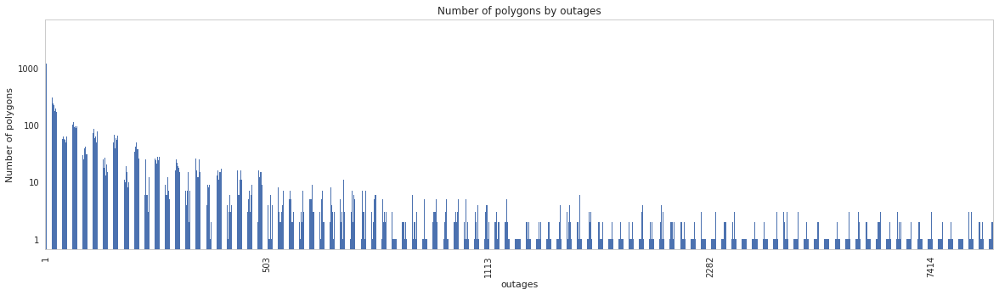


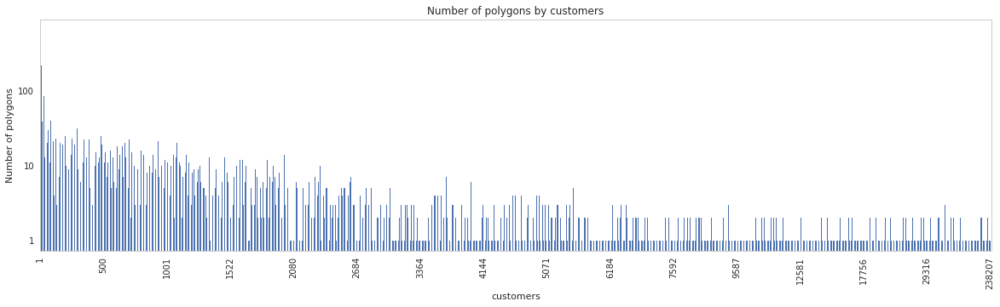


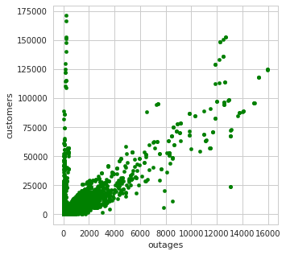


We can also scatter number of polygons against customers and outages.


```python
# Scatter
fig, ax = plt.subplots(figsize=(5,5))
df = pd.DataFrame(ene_dataset)
df['nro_polygons'] = df.loc[(df['outages'] >= 1), :].groupby(by=['outages']).count()['id']
df.plot(kind='scatter', x='nro_polygons', y='customers', ax=ax, c='green')
fig, ax = plt.subplots(figsize=(5,5))
df.plot(kind='scatter', x='nro_polygons', y='outages', ax=ax, c='green')
```


    <matplotlib.axes._subplots.AxesSubplot at 0x7faaa98f09e8>


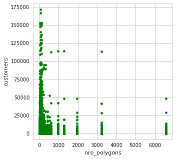


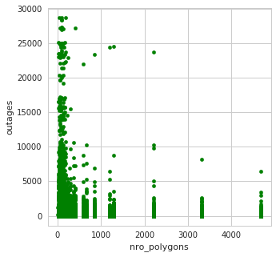


First, if number of outages is 0, the class is 0. Rest of the dataset could be divided to classes following (based on the first ploit): 

Class 1:   1 - 250  outages<br>
Class 2: 251 - 500  outages<br>
Class 3: 501 -      outages<br>

We can also classify the data based on number of customers respectively (based on the second plot): 

Class 1:    1 -  500 cusomters<br>
Class 2:  501 - 2500 customers<br>
Class 3: 2501 -     customers <br>


```python
# outages
limits = [(0,0), (1,250), (251,500), (501, 9999999)]
i = 0
for low, high in limits:
    ene_dataset.loc[(ene_dataset.loc[:, 'outages'] >= low) & (ene_dataset.loc[:, 'outages'] <= high), 'class'] = i
    i += 1
    
# outages
limits = [(0,1), (1,500), (501,2500), (2501, 9999999)]
i = 0
for low, high in limits:
    ene_dataset.loc[(ene_dataset.loc[:, 'customers'] >= low) & (ene_dataset.loc[:, 'customers'] <= high), 'class_customers'] = i
    i += 1

ene_dataset.loc[:, ['class', 'class_customers']] = ene_dataset.loc[:, ['class', 'class_customers']].astype(int)
print(ene_dataset.head())
print(ene_dataset.shape)
```

             id                storm_id              point_in_time  \
    0      4576    4576-WindGust-15-999  2010-01-01 00:00:00+00:00   
    117  482137  481833-WindGust-15-999  2014-10-23 00:00:00+00:00   
    116  482083  481833-WindGust-15-999  2014-10-22 23:00:00+00:00   
    115  482082  481465-WindGust-15-999  2014-10-22 23:00:00+00:00   
    114  482099  478047-WindGust-15-999  2014-10-22 23:00:00+00:00   
    
        weather_parameter low_limit high_limit  speed_self  angle_self  \
    0            WindGust        15        999 -999.000000 -999.000000   
    117          WindGust        15        999    2.393847  336.148021   
    116          WindGust        15        999    3.264672  165.229990   
    115          WindGust        15        999    3.069429  172.936362   
    114          WindGust        20        999   10.211669   14.969946   
    
              area_m2    area_diff  ... MAX Wind gust  MAX Temperature  \
    0       282711750         -999  ...            15              267   
    117   62408552814   2425513709  ...            17              278   
    116   59983039105     92091335  ...            17              278   
    115  745270279353  47217898519  ...            28              285   
    114    9187397687  -2551154565  ...            22              272   
    
        SUM Snowfall AVG Snowdepth AVG Mixed layer height MAX Precipitation kg/m2  \
    0              0             0                    990                       0   
    117            0             0                    921                       0   
    116            0             0                    903                       0   
    115            0             0                   1010                       0   
    114            0             0                    753                       0   
    
        outages customers class class_customers  
    0         0         0     0               0  
    117       0         0     0               0  
    116       0         0     0               0  
    115       0         0     0               0  
    114       0         0     0               0  
    
    [5 rows x 50 columns]
    (142876, 50)


#### Save/load dataset


```python
save_dataset(ene_dataset, table_name='classification_dataset_energiateollisuus')
dataset.set_index('point_in_time', inplace=True) # This is called also inside load_dataset
```

Load ready dataset from database:


```python
ene_dataset = load_dataset(table_name='classification_dataset_energiateollisuus')
```

## Analysis

### Loiste & JSE


```python
df = dataset.copy()
```

#### Number of different types of polygons

Number of different types of polygons:


```python
df.groupby(by=['weather_parameter', 'low_limit']).count()['id'].plot(kind='bar', title='Number of polygons')
```


    <matplotlib.axes._subplots.AxesSubplot at 0x7faab6ac72e8>


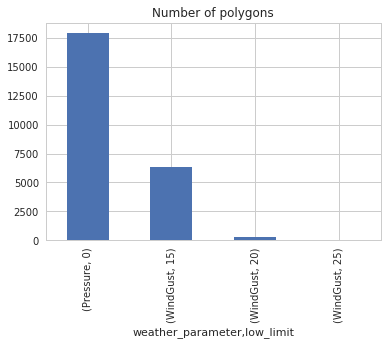


```python
df.groupby(by=['weather_parameter', 'low_limit']).count()['id']
```


    weather_parameter  low_limit
    Pressure           0            17880
    WindGust           15            6333
                       20             336
                       25               8
    Name: id, dtype: int64


#### Histogram of outage count

Number of outages caused by the storms.


```python
df.groupby(by=['outages']).count()['id']
```


    outages
    0      22597
    1       1207
    2        311
    3        139
    4         79
    5         40
    6         42
    7         36
    8         17
    9         13
    10        11
    11        13
    12         7
    13         4
    14         6
    15         2
    16         4
    17         2
    18         1
    19         2
    20         1
    23         2
    26         1
    27         1
    28         1
    32         1
    33         2
    34         1
    37         1
    39         1
    40         1
    41         1
    42         3
    43         1
    55         1
    58         1
    60         1
    75         1
    83         1
    114        1
    Name: id, dtype: int64


```python
fig, ax = plt.subplots(figsize=(20,5))
df.groupby(by=['outages']).count()['id'].plot(kind='bar', title='Number of outages', ax=ax)
plt.yscale('log')
ax.yaxis.set_major_formatter(mticker.ScalarFormatter())
ax.yaxis.get_major_formatter().set_scientific(False)
```


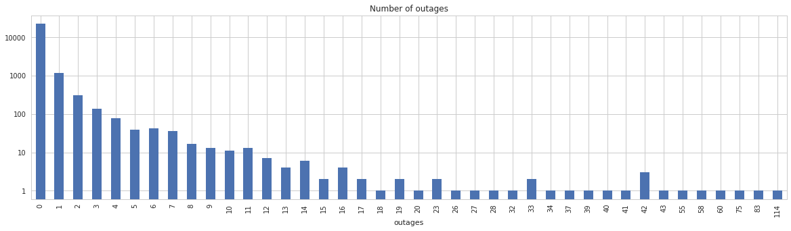


#### Class sizes


```python
fig, ax = plt.subplots(figsize=(20,5))
df.groupby(by=['class']).count()['id'].plot(kind='bar', title='Number of polygon by classes', ax=ax)
plt.yscale('log')
ax.yaxis.set_major_formatter(mticker.ScalarFormatter())
ax.yaxis.get_major_formatter().set_scientific(False)

fig, ax = plt.subplots(figsize=(20,5))
df.groupby(by=['class_customers']).count()['id'].plot(kind='bar', title='Number of polygon by customer classes', ax=ax)
plt.yscale('log')
ax.yaxis.set_major_formatter(mticker.ScalarFormatter())
ax.yaxis.get_major_formatter().set_scientific(False)
```


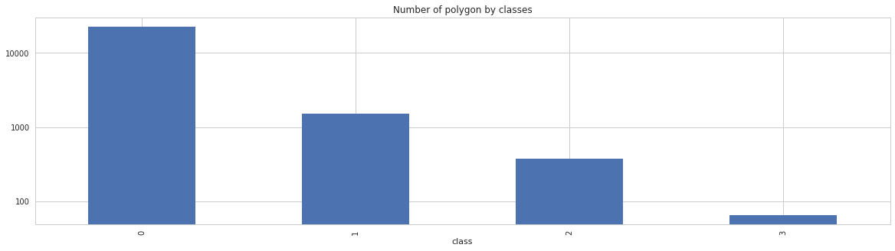


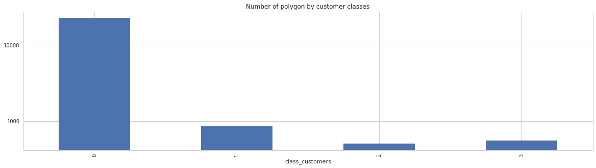


#### Timeseries of storms and outages

Storm objects cause some outages. It can be seen from a timeseries of storm objects and outages as well.


```python
def plot_outages(df, parameter, limit):

    fig, ax = plt.subplots(figsize=(15,6))
    ax2 = ax.twinx()
    df[(df.loc[:,'weather_parameter'] == parameter) & (df.loc[:,'low_limit'] == limit)].loc[:,'weather_parameter'].groupby(by=[pd.Grouper(freq='D')]).count().plot(ax=ax, label='Storm objects')
    df.loc[:, 'outages'].groupby(by=[pd.Grouper(freq='D')]).sum().plot(ax=ax2, color='r', linestyle='dashed', label='Outages')
    fig.autofmt_xdate()

    ax.set_ylabel('Number of storm objects')
    ax2.set_ylabel('Number of outages')

    h1, l1 = ax.get_legend_handles_labels()
    h2, l2 = ax2.get_legend_handles_labels()
    ax.legend(h1+h2, l1+l2, loc='upper left')            
    
    plt.title('{} limit {}'.format(parameter, limit))
    
plot_outages(df, 'WindGust', 15)
plot_outages(df, 'WindGust', 20)
plot_outages(df, 'WindGust', 25)
```


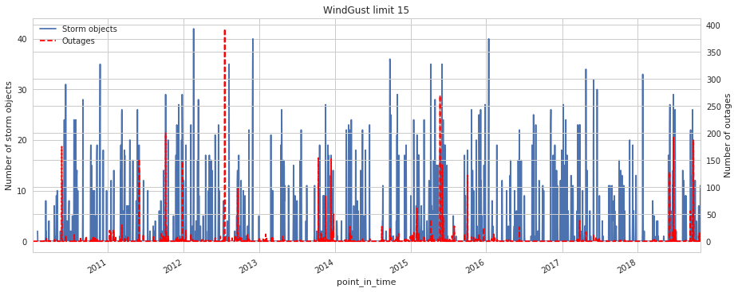


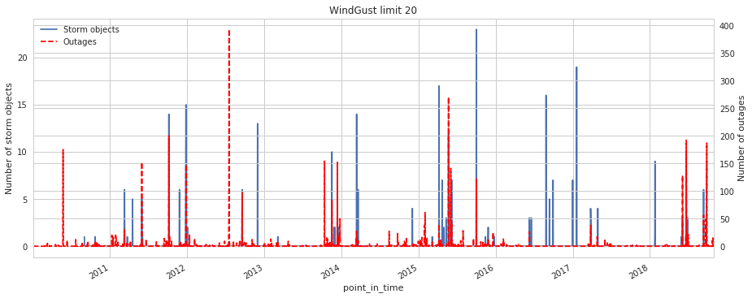


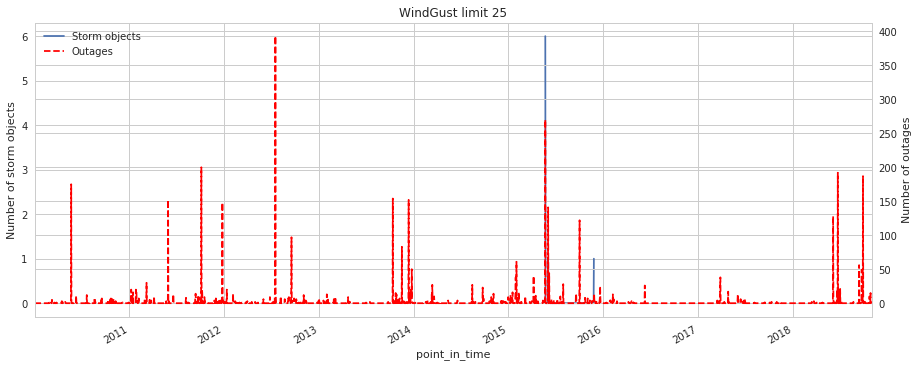


#### Correlation between storms and outages

Correlation between storm objects and number of outages. Strong correlation exists.


```python
def plot_pval(corr_df, ax):

    coeffmat = np.zeros((corr_df.shape[1], corr_df.shape[1]))
    pvalmat = np.zeros((corr_df.shape[1], corr_df.shape[1]))

    for i in range(corr_df.shape[1]):
        for j in range(corr_df.shape[1]):        
            corrtest = pearsonr(corr_df[corr_df.columns[i]], corr_df[corr_df.columns[j]])  

            coeffmat[i,j] = corrtest[0]
            pvalmat[i,j] = corrtest[1]

    pvalmat_df = pd.DataFrame(pvalmat, columns=corr_df.columns, index=corr_df.columns)
    #fig, ax = plt.subplots(figsize=(6,6))
    sns.heatmap(pvalmat_df, cmap="YlGnBu", annot=True, ax=ax)
    
def plot_corr(df):
    s = df[(df.loc[:,'weather_parameter'] == 'Pressure')].loc[:,'weather_parameter'].groupby(by=[pd.Grouper(freq='D')]).count()
    s2 = df[(df.loc[:,'weather_parameter'] == 'WindGust') & (df.loc[:,'low_limit'] == 15)].loc[:,'weather_parameter'].groupby(by=[pd.Grouper(freq='D')]).count()
    s3 = df[(df.loc[:,'weather_parameter'] == 'WindGust') & (df.loc[:,'low_limit'] == 20)].loc[:,'weather_parameter'].groupby(by=[pd.Grouper(freq='D')]).count()
    s4 = df[(df.loc[:,'weather_parameter'] == 'WindGust') & (df.loc[:,'low_limit'] == 25)].loc[:,'weather_parameter'].groupby(by=[pd.Grouper(freq='D')]).count()
    s5 = df.loc[:, 'outages'].groupby(by=[pd.Grouper(freq='D')]).sum()
    corr_df = pd.concat([s, s2, s3, s4, s5], axis=1, 
                        keys = ['Pressure', 'Wind Gust 15 m/s', 'Wind Gust 20 m/s', 'Wind Gust 25 m/s', 'Nro Outages'])
    corr_df.fillna(0, inplace=True)
    corr = corr_df.corr('pearson')

    fig, axes = plt.subplots(1, 2, figsize=(12,6))
    sns.heatmap(corr, cmap="YlGnBu", annot=True, ax=axes[0])
    axes[0].set_title('Correlation matrix')
    
    plot_pval(corr_df, ax=axes[1])
    axes[1].set_title('P-value test')
    plt.tight_layout()
```


```python
plot_corr(df)
```


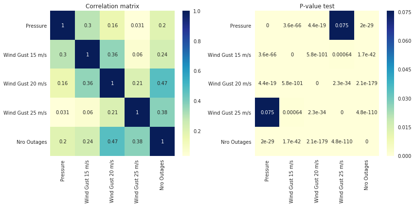


#### Correlation between weather parameters and outages

Correlation between outages and different weather parameters (see two last rows). Significant correlation exists with at least: speed, area, temperature, standard deviation of the wind speed, total column water vapor, mixed layer height, CAPE, Dewpoint, total cloud cover, wind gust and pressure.

At least CAPE is most probably related to convective weather. 

P-value test passes for all parameters.


```python
def plot_pval_(corr_df, ax):

    coeffmat = np.zeros((corr_df.shape[1], corr_df.shape[1]))
    pvalmat = np.zeros((corr_df.shape[1], corr_df.shape[1]))

    for i in range(corr_df.shape[1]):
        for j in range(corr_df.shape[1]):        
            corrtest = pearsonr(corr_df[corr_df.columns[i]], corr_df[corr_df.columns[j]])  

            coeffmat[i,j] = corrtest[0]
            pvalmat[i,j] = corrtest[1]

    pvalmat_df = pd.DataFrame(pvalmat, columns=corr_df.columns, index=corr_df.columns)
    g = sns.heatmap(pvalmat_df, cmap="YlGnBu", annot=True, ax=ax, annot_kws={"size": 20}, cbar=False)
    g.set_xticklabels(g.get_xmajorticklabels(), fontsize=45)
    g.set_yticklabels(g.get_ymajorticklabels(), fontsize=45, rotation=45)
    
df2 = df.loc[:, storm_params + outage_params].fillna(0)
corr = df2.corr('pearson')

#fig, axes = plt.subplots(1, 2, figsize=(45,30))
fig, axes = plt.subplots(2, 1, figsize=(60,120))
g = sns.heatmap(corr, cmap="YlGnBu", annot=True, ax=axes[0], annot_kws={"size": 20}, cbar=False)
g.set_xticklabels(g.get_xmajorticklabels(), fontsize=45)
g.set_yticklabels(g.get_ymajorticklabels(), fontsize=45, rotation=45)
axes[0].set_title('Correlation matrix')

plot_pval_(df2, ax=axes[1])
axes[1].set_title('P-value test')
plt.tight_layout()
```

    /home/ec2-user/anaconda3/envs/python3/lib/python3.6/site-packages/scipy/stats/stats.py:3010: RuntimeWarning: invalid value encountered in double_scalars
      r = r_num / r_den


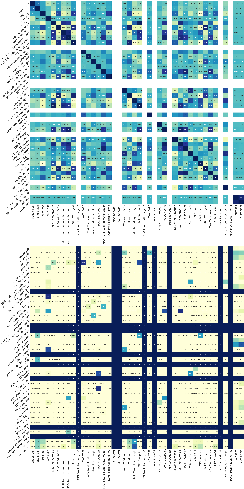


Let's consider only winter months (from beginning of October to end of January). Now we don't have significant correlation between CAPE and outages but we do have much stronger correlation between most other parameters. Distance to pressure object and wind speed introduce also a significant correlation with outages.

P-value test do not pass for several parameter any more, however. We have much less data (826 rows).


```python
df3 = df.loc[(df.index.month >= 10) | (df.index.month <= 1), storm_params + outage_params].fillna(0)
corr = df3.corr('pearson')

#fig, axes = plt.subplots(1, 2, figsize=(45,30))
fig, axes = plt.subplots(2, 1, figsize=(60,120))
g = sns.heatmap(corr, cmap="YlGnBu", annot=True, ax=axes[0], annot_kws={"size": 20}, cbar=False)
g.set_xticklabels(g.get_xmajorticklabels(), fontsize=45)
g.set_yticklabels(g.get_ymajorticklabels(), fontsize=45, rotation=45)
axes[0].set_title('Correlation matrix')

plot_pval_(df3, ax=axes[1])
axes[1].set_title('P-value test')
plt.tight_layout()
```

    /home/ec2-user/anaconda3/envs/python3/lib/python3.6/site-packages/scipy/stats/stats.py:3010: RuntimeWarning: invalid value encountered in double_scalars
      r = r_num / r_den


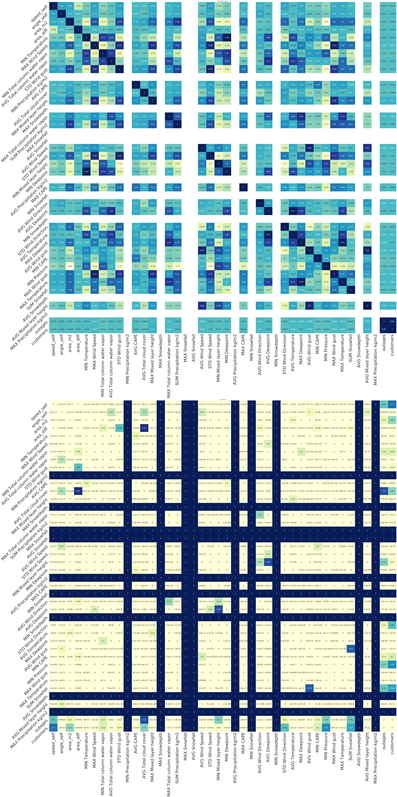


#### Scatter plots of outages and weather parameters

Scatter plot for outages with each parameters:


```python
def scatter_outages(df):
    fig, axes = plt.subplots(14,3, figsize=(30,90))
    row, col, i = 0, 0, 0
    for p in storm_params:
        row = int(i/3)
        col = i%3
        tdf = df.loc[(df[p] != -999), ['outages', p]].astype(float)
        tdf.plot(kind='scatter', x='outages', y=p, c='g', ax=axes[row][col])
        i += 1
```


```python
scatter_outages(df)
```


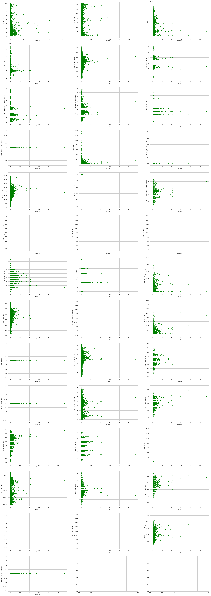


And the same for the winter months:


```python
scatter_outages(df3)
```


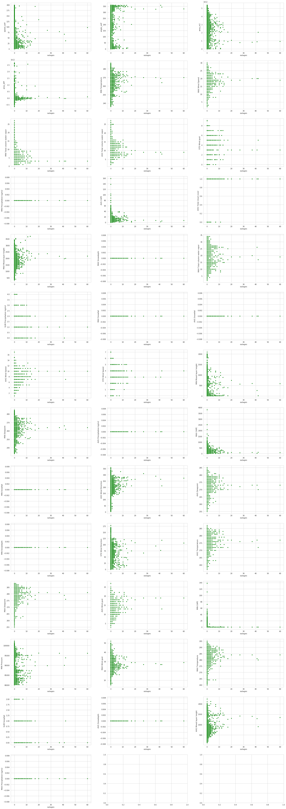


### Energiateollisuus


```python
df = ene_dataset.copy()
```

#### Number of different types of polygons


```python
df.groupby(by=['weather_parameter', 'low_limit']).count()['id'].plot(kind='bar', title='Number of polygons')
```


    <matplotlib.axes._subplots.AxesSubplot at 0x7faa82319cf8>


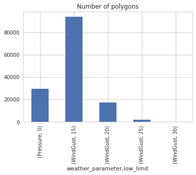


```python
df.groupby(by=['weather_parameter', 'low_limit']).count()['id']
```


    weather_parameter  low_limit
    Pressure           0            29690
    WindGust           15           93720
                       20           17240
                       25            1988
                       30             238
    Name: id, dtype: int64


#### Histogram of outage count

Number of outages caused by the storms.


```python
print(df.groupby(by=['outages']).count()['id'].head())
print('[...]')
print(df.groupby(by=['outages']).count()['id'].tail())
```

    outages
    0    107928
    1      3259
    2      4656
    3      1173
    4      2194
    Name: id, dtype: int64
    [...]
    outages
    27113    1
    27205    2
    27374    2
    28403    2
    28693    3
    Name: id, dtype: int64


```python
fig, ax = plt.subplots(figsize=(20,5))
df.groupby(by=['outages']).count()['id'].plot(kind='bar', title='Number of outages', ax=ax)
plt.yscale('log')
ax.yaxis.set_major_formatter(mticker.ScalarFormatter())
ax.yaxis.get_major_formatter().set_scientific(False)
```


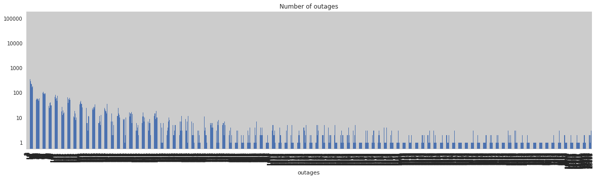


#### Class sizes


```python
fig, ax = plt.subplots(figsize=(20,5))
df.groupby(by=['class']).count()['id'].plot(kind='bar', title='Number of polygon by classes', ax=ax)
plt.yscale('log')
ax.yaxis.set_major_formatter(mticker.ScalarFormatter())
ax.yaxis.get_major_formatter().set_scientific(False)

fig, ax = plt.subplots(figsize=(20,5))
df.groupby(by=['class_customers']).count()['id'].plot(kind='bar', title='Number of polygon by customer classes', ax=ax)
plt.yscale('log')
ax.yaxis.set_major_formatter(mticker.ScalarFormatter())
ax.yaxis.get_major_formatter().set_scientific(False)
```


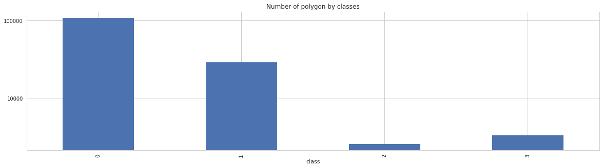


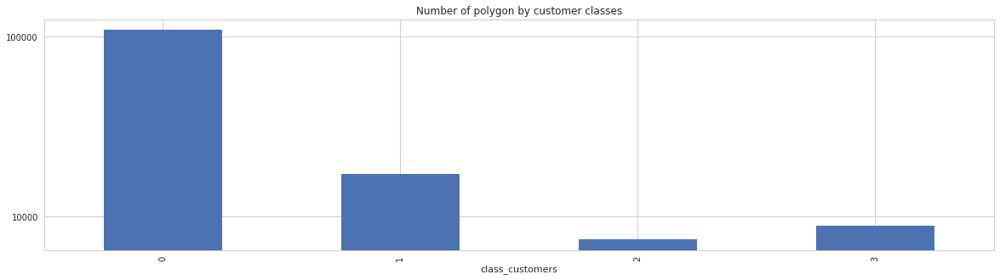


#### Timeseries of storms and outages

Storm objects cause some outages. It can be seen from a timeseries of storm objects and outages as well.


```python
def plot_outages(df, parameter, limit):

    fig, ax = plt.subplots(figsize=(15,6))
    ax2 = ax.twinx()
    df[(df.loc[:,'weather_parameter'] == parameter) & (df.loc[:,'low_limit'] == limit)].loc[:,'weather_parameter'].groupby(by=[pd.Grouper(freq='D')]).count().plot(ax=ax, label='Storm objects')
    df.loc[:, 'outages'].groupby(by=[pd.Grouper(freq='D')]).sum().plot(ax=ax2, color='r', linestyle='dashed', label='Outages')
    fig.autofmt_xdate()

    ax.set_ylabel('Number of storm objects')
    ax2.set_ylabel('Number of outages')

    h1, l1 = ax.get_legend_handles_labels()
    h2, l2 = ax2.get_legend_handles_labels()
    ax.legend(h1+h2, l1+l2, loc='upper left')            
    
    plt.title('{} limit {}'.format(parameter, limit))
    
plot_outages(df, 'WindGust', 15)
plot_outages(df, 'WindGust', 20)
plot_outages(df, 'WindGust', 25)
```

    /home/ec2-user/anaconda3/envs/python3/lib/python3.6/site-packages/pandas/core/arrays/datetimes.py:1172: UserWarning: Converting to PeriodArray/Index representation will drop timezone information.
      "will drop timezone information.", UserWarning)
    /home/ec2-user/anaconda3/envs/python3/lib/python3.6/site-packages/pandas/core/arrays/datetimes.py:1172: UserWarning: Converting to PeriodArray/Index representation will drop timezone information.
      "will drop timezone information.", UserWarning)
    /home/ec2-user/anaconda3/envs/python3/lib/python3.6/site-packages/pandas/core/arrays/datetimes.py:1172: UserWarning: Converting to PeriodArray/Index representation will drop timezone information.
      "will drop timezone information.", UserWarning)
    /home/ec2-user/anaconda3/envs/python3/lib/python3.6/site-packages/pandas/core/arrays/datetimes.py:1172: UserWarning: Converting to PeriodArray/Index representation will drop timezone information.
      "will drop timezone information.", UserWarning)
    /home/ec2-user/anaconda3/envs/python3/lib/python3.6/site-packages/pandas/core/arrays/datetimes.py:1172: UserWarning: Converting to PeriodArray/Index representation will drop timezone information.
      "will drop timezone information.", UserWarning)
    /home/ec2-user/anaconda3/envs/python3/lib/python3.6/site-packages/pandas/core/arrays/datetimes.py:1172: UserWarning: Converting to PeriodArray/Index representation will drop timezone information.
      "will drop timezone information.", UserWarning)


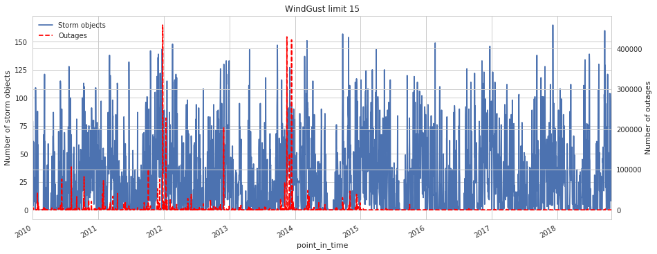


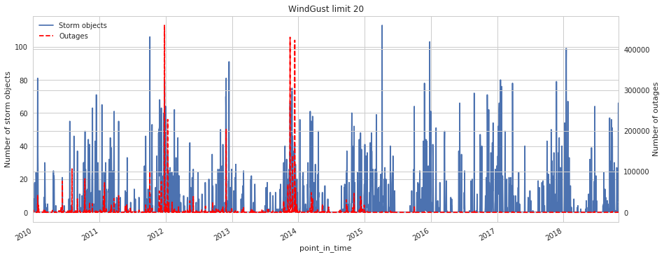


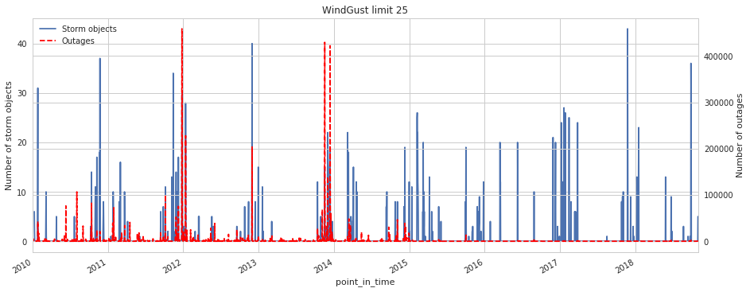


#### Correlation between storms and outages

Correlation between storm objects and number of outages. Strong correlation exists.


```python
plot_corr(df) # Function defined in Loiste & JSE analysis
```


#### Correlation between weather parameters and outages

Correlation between outages and different weather parameters (see two last rows). Significant correlation exists with at least: speed, area, temperature, standard deviation of the wind speed, total column water vapor, mixed layer height, CAPE, Dewpoint, total cloud cover, wind gust and pressure.

At least CAPE is most probably related to convective weather. 

P-value test passes for all parameters.


```python
df2 = df.loc[:, storm_params + outage_params].fillna(0)
corr = df2.corr('pearson')

#fig, axes = plt.subplots(1, 2, figsize=(45,30))
fig, axes = plt.subplots(2, 1, figsize=(60,120))
g = sns.heatmap(corr, cmap="YlGnBu", annot=True, ax=axes[0], annot_kws={"size": 20}, cbar=False)
g.set_xticklabels(g.get_xmajorticklabels(), fontsize=45)
g.set_yticklabels(g.get_ymajorticklabels(), fontsize=45, rotation=45)
axes[0].set_title('Correlation matrix')

plot_pval_(df2, ax=axes[1]) # Function defined in Loiste & JSE Analysis
axes[1].set_title('P-value test')
plt.tight_layout()
```

    /home/ec2-user/anaconda3/envs/python3/lib/python3.6/site-packages/scipy/stats/stats.py:3010: RuntimeWarning: invalid value encountered in double_scalars
      r = r_num / r_den


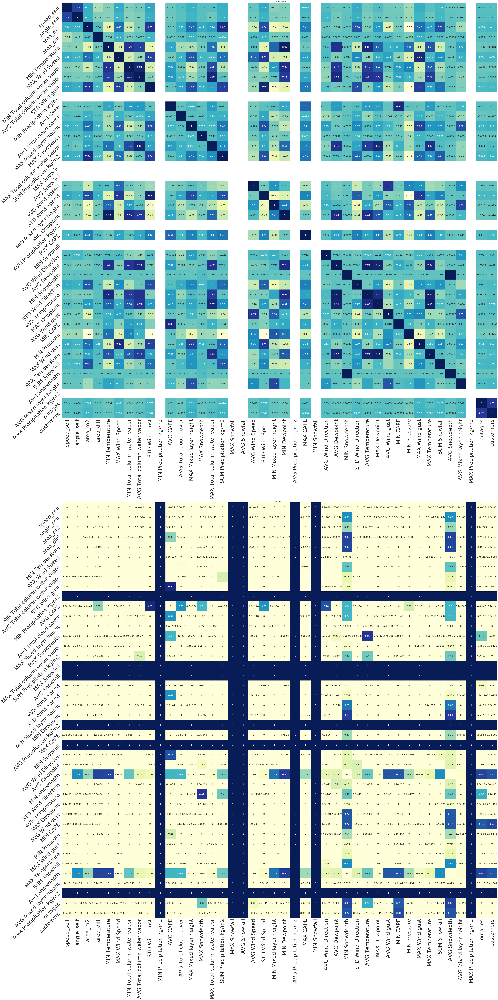


Let's consider only winter months (from beginning of October to end of January). Now we don't have significant correlation between CAPE and outages but we do have much stronger correlation between most other parameters. Distance to pressure object and wind speed introduce also a significant correlation with outages.

P-value test do not pass for several parameter any more, however. We have much less data (826 rows).


```python
df3 = df.loc[(df.index.month >= 10) | (df.index.month <= 1), storm_params + outage_params].fillna(0)
corr = df3.corr('pearson')

#fig, axes = plt.subplots(1, 2, figsize=(45,30))
fig, axes = plt.subplots(2, 1, figsize=(60,120))
g = sns.heatmap(corr, cmap="YlGnBu", annot=True, ax=axes[0], annot_kws={"size": 20}, cbar=False)
g.set_xticklabels(g.get_xmajorticklabels(), fontsize=45)
g.set_yticklabels(g.get_ymajorticklabels(), fontsize=45, rotation=45)
axes[0].set_title('Correlation matrix')

plot_pval_(df3, ax=axes[1])
axes[1].set_title('P-value test')
plt.tight_layout()
```

    /home/ec2-user/anaconda3/envs/python3/lib/python3.6/site-packages/scipy/stats/stats.py:3010: RuntimeWarning: invalid value encountered in double_scalars
      r = r_num / r_den


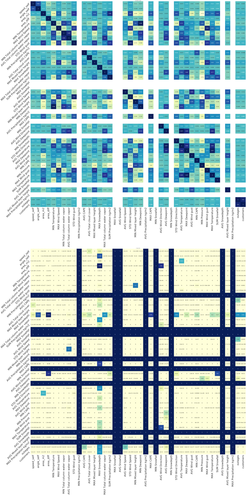


#### Scatter plots of outages and weather parameters


```python
scatter_outages(df) # Function defined in Loiste & JSE analysis
```


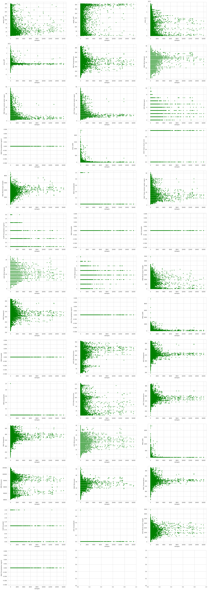


And the same for the winter months:


```python
scatter_outages(df3)
```


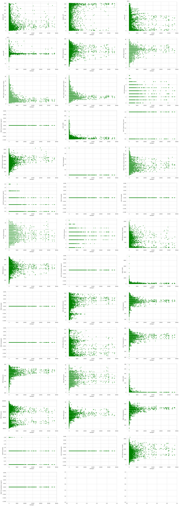

